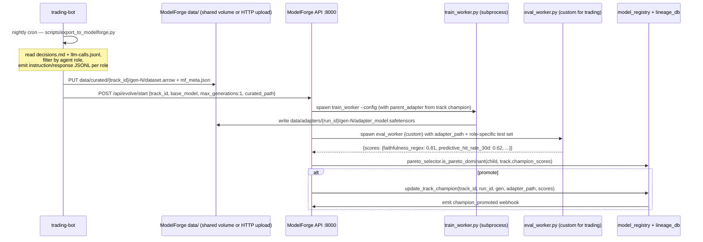
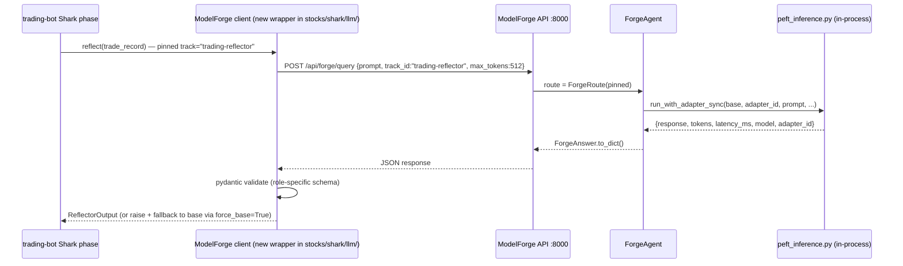

# Trading-bot ↔ ModelForge Integration Plan

**Status:** Spec-only. No code in either repo touched.
**Author intent:** Replace the planned bespoke continual-training pipeline for trading-bot LLM roles with ModelForge "tracks". Operator owns both repos.
**Grounded against ModelForge code at:** `/home/saijayanthai/Documents/spark/workspace/model-forge/` (the live tree under `apps/api/src/`; the root `src/` is a legacy mirror — ignore it).

---

## 1. ModelForge interfaces — what it accepts today

### 1.1 The "task" concept already exists, and it's called a **track**

ModelForge already supports the multi-task multi-champion concept we need. A *track* is:

- A row in Postgres `evolution_tracks`: `track_id`, `name`, `base_model`, `target_benchmarks JSONB`, `champion_adapter_path`, `champion_run_id`, `champion_generation`, `champion_scores JSONB`, `lora_rank`, `lora_alpha`, `learning_rate`, `max_samples`, `enabled` (`apps/api/src/services/lineage_db.py:521-554`).
- Routed via the **ForgeAgent** classifier at `apps/api/src/agents/forge_agent.py` and exposed at `POST /api/forge/query`, `POST /api/forge/compare`, `GET /api/forge/tracks` (`apps/api/src/api/routes/forge.py:28-272`).
- Promoted via either auto-sync from a global champion (`POST /api/forge/sync_tracks`, `forge.py:112-193`) or manual override (`POST /api/adapters/{id}/promote_to_track`, `apps/api/src/api/routes/adapters.py:448-509`).

This means **"register the trading-reflector LLM role"** maps cleanly to **"insert a track row + run an evolution that targets it"**. We do not need to invent a new abstraction.

### 1.2 Training data format — HuggingFace `datasets` Arrow on disk

`HuggingFaceDataCurator.curate()` (`apps/api/src/services/data_curator.py:149-269`) writes to `data/curated/gen-{N}/` as a `datasets.Dataset.save_to_disk()` Arrow shard with these features (confirmed against `data/curated/gen-3/dataset_info.json`):

```
category: string
source: string
dataset_name: string
instruction: string
response: string
```

Plus a sidecar `mf_meta.json` (`data_curator.py:244-258`) with `num_samples`, `categories`, `sources`, `weakness_report`, `max_samples`, `generation`. **This is the authoritative input contract for any custom curator.**

The trainer (`apps/api/src/agents/training_backend.py`) currently bypasses curated data entirely and hardcodes `Open-Orca/OpenOrca` (`training_backend.py:301`). **This is the single biggest blocker** — see §7. Wired correctly, it must `load_from_disk(<curated_path>)` and use the `instruction`/`response` fields.

### 1.3 Eval harness contract — drop-in `EvalBackend` Protocol

`EvalBackend` is a `Protocol` (`apps/api/src/agents/eval_backend.py:285-298`) with `async evaluate(*, run_id, generation, adapter_path, config=None, should_stop=None, bench_callback=None, bench_complete_callback=None) -> EvalResult`. `EvalResult.scores` is a free-form `dict[str, float]` (`eval_backend.py:268`) — there is no type enforcement of MMLU/GSM8K/etc. The five benchmark names are hardcoded in `_BENCHMARKS` (`eval_backend.py:193`) and `ScoreMap` (`api/schemas/models.py:6-12`), but neither `_avg()` (`evolution_graph.py:70`) nor `pareto_selector.is_pareto_dominant` (`pareto_selector.py:109`) cares about the keys. **A custom backend that obeys the Protocol is a drop-in** — no need to touch lm-eval-harness.

### 1.4 API surface, auth, on-disk layout, serving

Live router: `apps/api/src/api/router.py` (the root `src/api/router.py` is a legacy mirror missing `forge`, `adapters`, `automation`, `experiments`).

- `POST /api/evolve/start` — body `EvolutionRequest` (`api/schemas/evolution.py`). Closed schema today: `base_model`, `max_generations`, `lora_rank`, `lora_alpha`, `learning_rate`, `batch_size`. **No `track_id` field** — must extend (§6).
- `GET /api/forge/tracks`, `POST /api/forge/query` (with `track_id` for pinned route), `POST /api/forge/compare` — inference path (§3.2).
- `POST /api/adapters/{id}/promote_to_track`, `GET /api/models/champion`, `GET /api/adapters/`.

**Auth:** `X-API-Key` middleware reads `MODELFORGE_API_KEY` env (`config/settings.py:37, 102-103`); required in prod. Trading-bot needs it in `.env`.

**Adapter on-disk:** `data/adapters/{run_id}/gen-{N}/{adapter_config.json, adapter_model.safetensors, tokenizer*}` (PEFT, confirmed against `data/adapters/run-9d5f1b58/gen-3/`). Adapter id format `{run_id}__gen{N}` (`adapter_serve.py:18`, `peft_inference.py:106`).

**Three inference modes** already implemented: (1) Ollama via GGUF only — won't work on our PEFT output without llama.cpp conversion; (2) **in-process PEFT** via `POST /api/forge/query` (`peft_inference.py:118-178`) — loads base, attaches adapter, generates, unloads, ~200ms-1s per call once base is cached; (3) vLLM hint (registry stores `vllm_lora_path`, client points its own vLLM at it). **For trading-bot, mode 2 is the path of least resistance.**

---

## 2. The 6 trading-bot LLM roles → ModelForge tracks

For each role we name the track, the base, the data source, and the eval rule. Base models are operator's existing choices (see `MEMORY.md` → `project_session_2026-05-11_t30_checkpoint.md`: `hermes3:8b` for JSON, `qwen3:30b` for prose).

| `track_id` | Role | `base_model` (HF id) | Trading-bot data source | Custom eval signal |
|---|---|---|---|---|
| `trading-reflector` | Reflector / post-mortem | `Qwen/Qwen2.5-32B-Instruct` (proxy for `qwen3:30b` until a HF id exists) | `stocks/memory/decisions.md` blocks, one per closed trade | `faithfulness_regex` (pct of cited PnL/ticker/timestamp values that match the trade record) + `predictive_hit_rate_30d` |
| `trading-bull` | Bull analyst | `Qwen/Qwen2.5-32B-Instruct` | `stocks/memory/llm-calls.jsonl` filtered to `agent=bull_analyst` (already logged, see line above) | `evidence_citation_rate` (% bullets backed by a numeric data point in the input bundle) + `judge_preference_pct` against current champion |
| `trading-bear` | Bear analyst | `Qwen/Qwen2.5-32B-Instruct` | `stocks/memory/llm-calls.jsonl` filtered to `agent=bear_analyst` | same shape as bull, plus `opponent_acknowledgment_rate` |
| `trading-arbiter` | Portfolio Manager / Research Manager | `Qwen/Qwen2.5-32B-Instruct` | `stocks/memory/llm-calls.jsonl` filtered to `agent=research_manager` or `risk_manager` joined with the resolved trade outcome | `decision_consistency` (same evidence → same decision N>=2) + `downstream_pnl_per_decision` (post-trade realized + MTM PnL attributable to the call) + `structured_output_validity_rate` |
| `trading-regime-tagger` | JSON regime classification | `NousResearch/Hermes-3-Llama-3.1-8B` (proxy for `hermes3:8b`) | `stocks/kb/daily/*.json` (regime field) joined with manual operator overrides in `stocks/memory/override_verify.json` | `json_schema_validity_rate` (must validate against `override_verify.schema.json`) + `agreement_with_consensus_rate` (vs. an oracle that uses lookahead trend) |
| `trading-indicator-selector` | JSON ≤8-indicator picker | `NousResearch/Hermes-3-Llama-3.1-8B` | logs of `IndicatorSelector` calls with downstream Sharpe of the resulting strategy in `user_data/backtest_results/` | `json_validity_rate` + `selected_indicator_avg_sharpe` (mean Sharpe of the chosen indicator subset over the next 30d backtest window) |

Track rows are inserted via `LineageDB.upsert_track()` (`lineage_db.py:814-849`). The `target_benchmarks JSONB` field will hold *our* benchmark names (e.g. `["faithfulness_regex", "predictive_hit_rate_30d"]`) — the schema accepts arbitrary strings (`lineage_db.py:527`).

---

## 3. Data flow diagrams

### 3.1 Training-time



### 3.2 Inference-time



The trading-bot caches the `champion_adapter_path` per track for ~5 min so a brief ModelForge outage during market hours falls back gracefully via `force_base=True`.

---

## 4. Custom eval modules

All six modules live **in ModelForge**, in a new `apps/api/src/agents/eval_backends_trading/` package (one file per role). They implement the existing `EvalBackend` Protocol (`eval_backend.py:285-298`) and are dispatched based on `config["track_id"]` in a thin selector. Pseudocode signatures:

```python
# eval_backends_trading/reflector.py
class ReflectorEvalBackend:
    name = "trading_reflector"

    async def evaluate(self, *, run_id, generation, adapter_path, config=None, **cb) -> EvalResult:
        eval_set = load_jsonl(config["eval_set_path"])  # held-out trades
        responses = run_adapter_batch(adapter_path, [r["prompt"] for r in eval_set])
        return EvalResult(scores={
            "faithfulness_regex":          regex_score(responses, eval_set),
            "judge_score":                 await llm_judge(responses, eval_set, judge="hermes3:8b"),
            "debate_impact_change_rate":   ab_decision_change_rate(responses, eval_set),
            "predictive_hit_rate_30d":     hit_rate_against_outcomes(responses, eval_set),
        })
```

| Module | Score keys | Scoring rule |
|---|---|---|
| `reflector` | `faithfulness_regex`, `judge_score`, `debate_impact_change_rate`, `predictive_hit_rate_30d` | regex match of cited numerics; LLM judge (hermes3:8b) score 0-1; A/B test whether the reflection changes downstream debate outcome; hit rate of the predicted direction over realized 30d return |
| `bull` | `evidence_citation_rate`, `opponent_acknowledgment_rate`, `judge_preference_pct` | % bullets cite a number from input; % times prior bear point was named; pairwise judge prefers child over parent |
| `bear` | same as `bull` | symmetric |
| `arbiter` | `decision_consistency`, `downstream_pnl_per_decision`, `structured_output_validity_rate` | Spearman of (similar evidence → similar decision); $ realized + MTM per decision attributable to the call; pydantic validation pass rate |
| `regime_tagger` | `json_schema_validity_rate`, `agreement_with_consensus_rate` | jsonschema against `override_verify.schema.json`; agreement vs lookahead-truth oracle |
| `indicator_selector` | `json_validity_rate`, `selected_indicator_avg_sharpe` | jsonschema; mean Sharpe over a 30d backtest window using only the selected indicators |

**Key design property:** every score lives in `[0.0, 1.0]` (or is normalized to it) so `_avg()` (`evolution_graph.py:70`) and `pareto_selector` work without changes. PnL is normalized via a sigmoid around $0.

---

## 5. Integration architecture

### Goes IN ModelForge (PRs to spark/workspace/model-forge)

1. **6 track rows** seeded via a one-shot migration that calls `LineageDB.upsert_track()` (`lineage_db.py:814`). Idempotent.
2. **6 eval-backend classes** in `apps/api/src/agents/eval_backends_trading/` + a tiny dispatcher in `runner._select_backends` (`apps/api/src/agents/runner.py:48-55`) that picks the trading backend when `config.get("track_id", "").startswith("trading-")`.
3. **Curated-path passthrough in trainer**: `_train_sync_inner` currently hardcodes `load_dataset("Open-Orca/OpenOrca", split="train[:1000]")` (`training_backend.py:301`). Change to: if `config.get("curated_path")` is set, `load_from_disk(curated_path)` and remap `instruction`/`response` to `text` via the existing `_format_sample`. Backward-compatible default kept.
4. **`EvolutionRequest` schema additions** (`apps/api/src/api/schemas/evolution.py:7-14`): add optional `track_id: str | None`, `curated_path: str | None`, `eval_backend: str | None` (e.g. `"trading_reflector"`), `eval_set_path: str | None`. All optional → backward compatible.
5. **Optional**: a `POST /api/curated/upload` route that accepts a JSONL stream and writes `data/curated/{track_id}/gen-N/` via `Dataset.from_list().save_to_disk()`. Cheaper alternative: shared filesystem bind-mount + the trading-bot writes directly. **Recommendation: shared bind-mount.** Both repos run on the same DGX host; HTTP upload is unnecessary overhead and re-introduces the auth/rate-limit surface we don't need internally.

### Stays IN trading-bot (PRs to trading-bot)

1. **`stocks/scripts/export_to_modelforge.py`** — nightly script. Reads `decisions.md` + `llm-calls.jsonl` + outcome resolver output, partitions by role, emits per-role `dataset.arrow` + `mf_meta.json` straight into `<MODELFORGE_DATA_ROOT>/curated/{track_id}/gen-N/`. Deduplication by content-hash against prior generations.
2. **`stocks/shark/llm/modelforge_client.py`** — thin wrapper around `httpx.AsyncClient`. One method per role: `reflect()`, `bull()`, `bear()`, `arbiter()`, `tag_regime()`, `pick_indicators()`. Each pins its track via `POST /api/forge/query {track_id: ..., prompt: ...}`. Pydantic-validates the response. On 5xx or pydantic failure, retries with `force_base=True` (returns base-model output).
3. **Champion-path cache**: `stocks/shark/llm/_track_cache.py` polls `GET /api/forge/tracks` every 5 minutes and stores `track_id → {adapter_path, scores, base_model}`. Survives a 2-min ModelForge outage during market hours by serving stale.
4. **Decision-log helpers stay where they are** (`stocks/memory/decisions.md`, `llm-calls.jsonl`). The export script reads them; nothing in the hot path changes.

### Shared via

- **HTTP**: ModelForge API on `:8000` (existing). Trading-bot reads via `httpx`. `MODELFORGE_API_KEY` in trading-bot's `.env`.
- **Filesystem**: shared bind-mount of `model-forge/data/` for adapters (read-only from trading-bot) and curated/ (read-write from trading-bot's exporter). Mount path operator picks; suggest `/srv/modelforge-data/` symlinked into both compose stacks.
- **No direct DB access from trading-bot.** Postgres stays internal to ModelForge. Lineage queries go via REST.

---

## 6. Day-by-day implementation plan

**Day 1 — Plumbing.** Land MIT license on ModelForge (sibling `stage/license-mit` must merge first). Write `stocks/scripts/export_to_modelforge.py`; dry-run; verify Arrow shard + `mf_meta.json` are loadable via `datasets.load_from_disk()`. Decide bind-mount path; update both compose files.

**Day 2 — ModelForge schema + dispatcher.** Extend `EvolutionRequest` with four optional fields (§5.4). Add `eval_backends_trading/` package with stub classes (return constant `0.5`) for all six roles. Add dispatcher in `runner.py`. Smoke: `POST /api/evolve/start {track_id, curated_path}` writes a `track_generations` row. Seed the 6 tracks via a one-off `seed_trading_tracks` script.

**Day 3 — First end-to-end: `trading-reflector`.** Implement real `ReflectorEvalBackend` (§4) with last-30-closed-trades held out. Wire curated-path passthrough into `training_backend.py` (§5.3). Run one full evolution on DGX; confirm adapter saved, generation row written, `champion_adapter_path` updated. Trading-bot: write `modelforge_client.reflect()`, swap existing Reflector call behind `USE_MODELFORGE_REFLECTOR=1` flag. Run existing reflector unit tests against it.

**Day 4-5 — Roll out remaining 5 roles.** One per half-day: `bull`, `bear`, `arbiter`, `regime_tagger`, `indicator_selector`. Each gets real eval module + exporter wiring + client method + feature flag + replay test. **Watch:** `target_benchmarks` JSONB must be set per track or `sync_tracks` no-ops (`forge.py:152`).

**Day 6 — Optional: vLLM.** If PEFT cold-start (~2-3s per base swap, `peft_inference.py:43`) hurts the Shark fan-out, stand up vLLM with `--enable-lora` pointing at `data/adapters/`. ModelForge already writes the `vllm_lora_path` hint (`adapter_serve.py:594`). Client adds a `--vllm` mode hitting `vllm:8001/v1/completions`.

**Day 7 — Smoke + dashboard.** 24h paper-mode with all six tracks active. Trading-bot dashboard: add "ModelForge tracks" card pulling `GET /api/forge/tracks`. Verify Slack `champion_promoted` events (already wired, `lineage_db.py:601-604`).

---

## 7. Risks + open questions

**R1 — Eval contract permissive; router hardcodes 5 benchmark names.** `EvalResult.scores` is free-form `dict[str, float]` (`eval_backend.py:268`); Pareto, `_avg`, and `save_score` (`lineage_db.py:185`) accept any string keys. ✅ No blocker. But `ScoreMap` (`api/schemas/models.py:6`) and `_BENCHMARKS` catalog (`api/routes/evaluation.py:27-58`) hardcode the 5 LM-eval keys. The frontend's score charts render trading metrics as unlabeled keys until catalog extended. **Non-blocking** — trading-bot dashboard renders off `/api/forge/tracks` instead.

**R2 — Multi-base.** `_train_sync_inner` reads `base_model` per-call (`training_backend.py:256`) and `LMEvalHarnessBackend.evaluate` likewise (`eval_backend.py:432`). ✅ Each track has its own base; subprocess isolation (`training_backend.py:170`) makes this safe on unified-memory DGX. **Caveat:** `qwen3:30b` / `hermes3:8b` are Ollama tags, not HF ids. `resolve_hf_base_model_id` (`utils/hf_model_id.py`) needs entries, or pass the HF id directly in `EvolutionRequest.base_model`.

**R3 — Curated data vs trading-bot logs (soft blocker).** `llm-calls.jsonl` today logs *metadata only* (`{agent, model, role, prompt_tokens, completion_tokens, ...}`), no prompt/response text. **The exporter has nothing to convert.** Mitigation: extend the trading-bot LLM logger to also write `prompt` + `response` fields (one-line change; ~10-50MB/day storage). Without this, the entire integration is dead in the water.

**R4 — Resource contention.** ModelForge default cron `0 3 * * *` (`lineage_db.py:560`); trading-bot TFT retrain Sunday 02:00. ✅ Don't collide today, but a "full six-track sequential evolution" overruns. Mitigation: trading-bot exporter writes curated/ on Sunday 01:00; ModelForge schedule moves to Sunday 04:00 and runs the six tracks sequentially via `POST /api/experiments/` (`api/routes/experiments.py:86-133`). ~30min/track → <4h total, clear of Monday open. Memory guard (`utils/memory_guard.py`) protects against the unified-memory freeze fingerprint.

**R5 — PEFT vs Ollama serve.** Ollama needs GGUF (`adapter_serve.py:30`); we output PEFT/safetensors. In-process PEFT (`peft_inference.py:118`) works with 2-3s cold start. LRU cache size is 1 (`peft_inference.py:29`) — thrashes if qwen3:30b + hermes3:8b serve in the same minute. **Mitigation:** raise `_CACHE_LIMIT` to 2 once multi-base, or move to vLLM (Day 6).

**R6 — Two source trees.** `src/` at repo root is a legacy mirror missing tracks/forge/adapters/automation. Live code is `apps/api/src/`. ⚠️ Operator confirm: delete `src/` or leave it? Spec targets only `apps/api/src/`.

### Open questions for tomorrow's operator

1. Confirm bind-mount path (`/srv/modelforge-data/` vs HTTP upload). Spec recommends bind-mount.
2. Confirm `qwen3:30b` ↔ HF id mapping (e.g. `Qwen/Qwen2.5-32B-Instruct`?) — what's actually available on HF that matches your Ollama model.
3. Approve extending `llm-calls.jsonl` to log `prompt` + `response` text (R3). Without it, no exporter is possible.
4. Decide: kill the legacy root-level `src/` or leave it (R6).
5. Confirm Sunday 04:00 evolution slot is operationally OK (R4).

---

## Key file reference

ModelForge (`apps/api/src/`): `agents/evolution_graph.py` · `agents/training_backend.py` (OpenOrca hardcode at L301) · `agents/eval_backend.py` (`EvalBackend` Protocol L285) · `agents/runner.py` (`_select_backends` L48) · `agents/forge_agent.py` · `services/{data_curator,pareto_selector,peft_inference,adapter_serve,model_registry,lineage_db}.py` · `api/routes/{evolution,forge,adapters,inference,models,evaluation}.py` · `api/schemas/{evolution,inference,models,evaluation}.py` · `config/settings.py`.

Trading-bot: `stocks/memory/{llm-calls.jsonl,decisions.md,override_verify.schema.json}` · `stocks/kb/daily/*.json` · `user_data/backtest_results/`.
