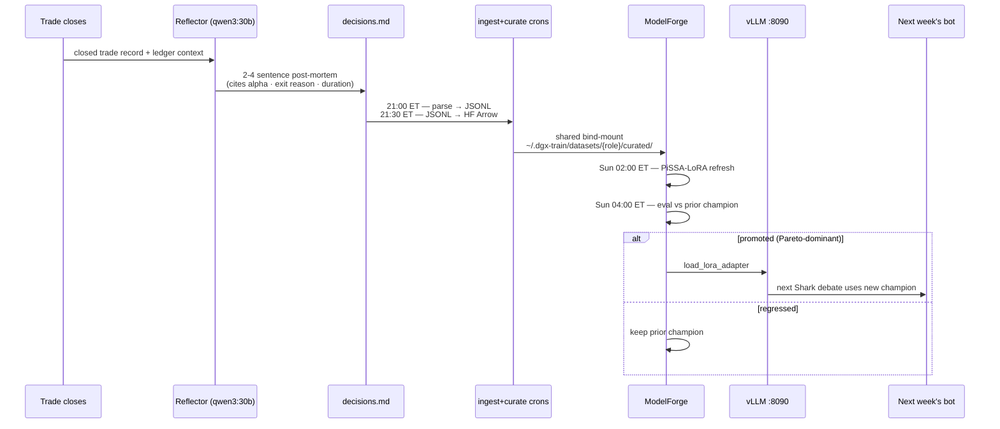

<!-- Licensed under the MIT License — see LICENSE at repo root.
     Copyright (c) 2026 Sai Jayanth. -->

<div align="center">

# Quanta — Self-Improving Local Trading Agent

**Fully local, multi-agent paper-trading stack on a single NVIDIA DGX Spark. Zero paid LLM APIs.
Writes a post-mortem after every closed trade. Every Sunday at 02:00 ET, those post-mortems
train a LoRA adapter that makes next week's decisions sharper.**

[](#whats-actually-working-today)
[](LICENSE)
[](pyproject.toml)
[](docker-compose.yml)
[-76b900)](#hardware--cost)
[](tests/)
[](#operator-decisions-locked)

</div>

---

## Why this exists

Every public "AI trading agent" repo we found does one of three things: prompt-scaffolds a paid
frontier model that costs more in API calls than the strategy makes; ships a research
notebook that prints BUY/SELL strings but never wires them to an exchange; or simulates a
trading desk full of LLM personas with zero feedback loop, so the agent never gets better than
the day it was deployed.

Quanta is the inverse. It runs a **real Freqtrade paper-trading loop** on local hardware, with
a **multi-agent debate layer** that runs entirely on local Ollama + vLLM, and — the part that
matters — a **continual-learning loop** where every closed paper trade writes a post-mortem,
those post-mortems become training data, and a LoRA adapter retrains weekly to make the next
week's decisions sharper. The trading hot path never touches a paid API. Adapters are the only
artifact that leaves the box, and only to a private HuggingFace Hub repo.

---

## What's actually working today

Honest list. Roadmap items live in [Roadmap](#roadmap).

- **Multi-asset paper trading** — Freqtrade running FreqAI mean-reversion on 12 Coinbase
  crypto pairs + a wheel CSP/CC strategy on 14 Alpaca paper stocks.
- **Multi-agent Shark debate** — 6-role LLM stack (Bull · Bear · Arbiter · Reflector · Regime
  Tagger · Indicator Selector) running on local Ollama (`qwen3:30b` for prose, `hermes3:8b`
  for JSON). Two-tier graph: cheap fan-out, deep-tier escalation only when conviction
  diverges.
- **HTTP-only ModelForge boundary** — sibling [model-forge](https://github.com/saijayanthai/model-forge)
  repo owns every adapter, every eval, every promotion gate. Trading-bot never imports its
  code, never reads its DB.
- **Reflection-driven feedback loop** — `nightly_reflector` cron at 23:00 ET writes a 2-4
  sentence post-mortem per closed trade to `stocks/memory/decisions.md`, then a curate cron
  reshapes those into HF Arrow training data for the Sunday LoRA refresh.
- **Production safeguards** — 8-gate risk governor (drawdown, daily loss, circuit breaker,
  position count, position size, correlation, capital allocation, half-Kelly cap), editable
  via YAML at runtime from the dashboard.
- **Auto-rollback cron** — daily loss > 3% triggers `dry_run` enforce + open-order cancel.
  Tested with mocked equity curves; verified in `tests/test_auto_rollback.py`.
- **Regime-stability gate** — entries blocked within 2h of an HMM regime flip. Killed the
  whip-saw pattern that cost three losers last week.
- **vLLM 0.5+ multi-LoRA serving** (profile-gated, off by default) — Qwen3-30B base on :8090
  with hot-swap adapters via `/v1/load_lora_adapter`. Sub-10ms PCIe fetch per swap.
- **Pickle-safe TFT model saves** — atomic `tempfile.NamedTemporaryFile` + `os.replace`. No
  more half-written checkpoints when a training run is killed mid-flight.
- **Live dashboard cards** — `TodayScoreboard`, `BacktestGatesLive`, `WeeklyTrainingLive`,
  `SharkOverrideHealthLive`, `LLMCallsLive`, plus an in-dashboard `risk_gates` editor that
  hot-reloads thresholds without a restart.
- **277 passing tests, 3 explicit skips.** `pytest tests/` clean on a fresh checkout. Audited
  via [`PRODUCTION_AUDIT_2026-05-12.md`](PRODUCTION_AUDIT_2026-05-12.md).

---

## Architecture

Two views of the same picture. The ASCII version is for terminal readers grepping the README;
the Mermaid version is for the GitHub web view.

### ASCII — the two-repo boundary

```
                       ┌──────────────────────────────────────┐
                       │   trading-bot  (this repo · MIT)     │
                       │                                      │
   Coinbase / Alpaca ─►│  • Freqtrade + FreqAI (12 crypto)    │
                       │  • Wheel runner (14 stocks)          │
                       │  • Shark debate (Bull/Bear/Arbiter)  │
                       │  • Reflector (post-mortem writer)    │
                       │  • Regime / Indicator JSON taggers   │
                       │  • Risk governor (8 hard gates)      │
                       │  • Hermes cron orchestrator          │
                       │  • FastAPI + React dashboard         │
                       │  • TimescaleDB trade journal         │
                       └──┬───────────────────────────────┬───┘
                          │                               ▲
            JSONL/Arrow   │ HTTP only — no shared DB      │ HTTP only
            curated/      ▼ ~/.dgx-train/datasets/        │ /api/forge/query
                          │                               │ with track_id
                       ┌──┴───────────────────────────────┴───┐
                       │   model-forge  (sibling repo · MIT)  │
                       │                                      │
                       │  • LangGraph evolution orchestrator  │
                       │  • Unsloth LoRA training (PiSSA)     │
                       │  • Custom EvalBackend per role       │
                       │  • Pareto promotion gates            │
                       │  • Lineage DB (Postgres + pgvector)  │
                       │  • vLLM multi-LoRA serving :8090     │
                       │  • Adapter-evolution dashboard :3001 │
                       └──────────────────────────────────────┘
                                       │
                                       ▼
                       ┌──────────────────────────────────────┐
                       │   HuggingFace Hub (private repo)     │
                       │   adapters only · no raw trades      │
                       └──────────────────────────────────────┘
```

### Mermaid — closed-loop training flow

```mermaid
flowchart LR
    MKT([Coinbase / Alpaca<br/>OHLCV + sentiment]) --> STRAT[Strategy layer<br/>FreqAI MR · Wheel · Shark debate]
    STRAT --> RISK{Risk governor<br/>8 hard gates}
    RISK -- blocked --> JRNL[(Trade journal<br/>TimescaleDB)]
    RISK -- pass --> EXEC[Execute paper order]
    EXEC --> JRNL
    JRNL --> REFL[Reflector cron<br/>23:00 ET]
    REFL --> DEC[(decisions.md<br/>llm-calls.jsonl)]
    DEC --> ING[modelforge_ingest<br/>21:00 ET]
    ING --> CUR[modelforge_curate<br/>21:30 ET]
    CUR --> ARROW[(HF Arrow<br/>~/.dgx-train/datasets/)]
    ARROW -. shared bind-mount .-> MF[ModelForge :8000]
    MF --> TRAIN[Sunday 02:00 ET<br/>PiSSA-LoRA rank=16]
    TRAIN --> EVAL[Eval per role<br/>faithfulness · hit-rate · judge]
    EVAL --> PARETO{Pareto<br/>dominant?}
    PARETO -- yes --> PROMOTE[Promote champion<br/>+ push to HF Hub]
    PARETO -- no --> ROLLBACK[Keep prior champion]
    PROMOTE --> SERVE[vLLM :8090<br/>load_lora_adapter]
    SERVE --> STRAT
```



---

## What makes this different

A fair comparison against the projects we learned from. We borrowed patterns from each (see
[Acknowledgements](#acknowledgements)). They were never trying to do this — calling them out
is a positioning exercise, not a takedown.

| Project | Real execution? | Continual learning? | Local-only LLMs? | Multi-asset? | Risk gates? |
|---|---|---|---|---|---|
| [TauricResearch/TradingAgents](https://github.com/TauricResearch/TradingAgents) | research framework; emits ratings | no | optional | single-ticker | none |
| [ruvnet/ruflo](https://github.com/ruvnet/claude-flow) | not a trading project | n/a | n/a | n/a | n/a |
| [virattt/dexter](https://github.com/virattt/dexter) | research Q&A | no | requires OpenAI | research only | none |
| [virattt/ai-hedge-fund](https://github.com/virattt/ai-hedge-fund) | persona simulation | no | requires paid LLMs | stocks demo | none |
| **Quanta (this repo)** | **yes — Freqtrade + Alpaca** | **yes — weekly LoRA refresh** | **yes — Ollama + vLLM** | **crypto + stocks + options wheel** | **8 hard gates** |

The combination matters. Anyone can run a backtest. The interesting question is whether the
agent gets sharper over time when it has to live with its own losers — and whether you can
prove it without a paid frontier model in the loop.

---

## Quickstart

```bash
git clone https://github.com/saijayanthai/trading-bot.git
cd trading-bot
cp .env.example .env  # then edit — see "Tech stack" for required keys
docker compose up -d
```

Verify the stack is alive:

```bash
curl -s http://localhost:8081/api/mode | python3 -m json.tool
# {"mode":"paper","state":"running","dry_run":true}
```

Open the dashboard: **<http://localhost:8081/ops>** (or `/` for the SPA index).

**Don't have a DGX Spark?** A `MODEL_TIER` env knob is on the roadmap — it will auto-pick
`llama3.2:3b` instead of `qwen3:30b` on consumer hardware. Until that lands, the bot will run
fine on any host with Ollama and 24+ GB of GPU memory; quality degrades gracefully.

For step-by-step bring-up + emergency runbook, see [`CHECKLIST.md`](CHECKLIST.md).

---

## Tech stack

| Layer | Tool | Version | Why |
|---|---|---|---|
| Trading engine | [Freqtrade](https://www.freqtrade.io/) | `stable_freqaitorch` | mature paper trading, FreqAI for model retraining, REST + WS API |
| ML hot-path | [FreqAI](https://www.freqtrade.io/en/stable/freqai/) + TFT | torch 2.4+ | Temporal Fusion Transformer + 4-state HMM regime |
| LLM serving (warm) | [Ollama](https://ollama.com/) | latest | `hermes3:8b` for JSON, `qwen3:30b` for prose |
| LLM serving (hot-swap LoRA) | [vLLM](https://github.com/vllm-project/vllm) | `>=0.5` | LoRA adapter hot-swap per request (~10ms) |
| Training | [model-forge](https://github.com/saijayanthai/model-forge) | sibling repo | Unsloth · PiSSA · LangGraph · Pareto promotion |
| Storage | [TimescaleDB](https://github.com/timescale/timescaledb) | `2.26.4-pg16` | trade journal · regime log · sentiment · on-chain |
| Cron | [Hermes](https://github.com/saijayanthai/hermes) | sibling tool | ET-local timezone, 26+ jobs |
| Dashboard | FastAPI + Jinja + plain SPA JS | py 3.12 | `/ops` cards · `/api/ops/*` endpoints |
| Brokers (paper) | [Coinbase Advanced Trade](https://www.coinbase.com/advanced-trade) + [Alpaca](https://alpaca.markets/) | — | crypto + stocks/options |
| Metrics | InfluxDB + Grafana | latest | order latency · sentiment lag · regime transitions |

Required keys in `.env`: `SLACK_WEBHOOK_URL`, Coinbase + Alpaca paper credentials, `POSTGRES_PASSWORD`. Optional: `PERPLEXITY_API_KEY` (news), `CRYPTOQUANT_API_KEY` / `WHALE_ALERT_API_KEY` / `GLASSNODE_API_KEY` (on-chain — each fails open with neutral defaults).

See [`requirements-extra.txt`](requirements-extra.txt) for Python pins and
[`docker-compose.yml`](docker-compose.yml) for the full service graph.

---

## The 6 LLM roles

Every role is a `track_id` in ModelForge. Each gets its own LoRA stack on top of a shared
base model. Eval rules per role live in
[`docs/MODELFORGE_INTEGRATION_PLAN.md`](docs/MODELFORGE_INTEGRATION_PLAN.md) §4.

| Track | Base model | Job | Where it fires |
|---|---|---|---|
| `trading-reflector` | qwen3:30b | writes the 2-4 sentence post-mortem, cites alpha vs benchmark | nightly cron, one call per closed trade |
| `trading-bull` | qwen3:30b | bullish debater, evidence-bullet prose | 5-15× per pre-market debate fan-out |
| `trading-bear` | qwen3:30b | bearish debater, mirrors the bull | 5-15× per pre-market debate fan-out |
| `trading-arbiter` | qwen3:30b | Portfolio Manager · structured `TraderProposal` | 1× per debate, after fan-out collapses |
| `trading-regime-tagger` | hermes3:8b | JSON regime classifier (trending_up / trending_down / chop / bear_volatile) | intraday |
| `trading-indicator-selector` | hermes3:8b | ≤8 indicators per regime, returns JSON | per pair-day |

Today: all six roles route to the base model via Ollama. As ModelForge promotes adapters,
each role routes to its own promoted champion via vLLM. Falls back to the base model
transparently when vLLM is unreachable — trading does not stop.

---

## The reflection loop (the moat)

The piece nobody else is doing. In 6 steps:

1. **The bot places a paper trade** based on the Shark debate output + the FreqAI signal +
   the risk governor's verdict. Everything is logged to TimescaleDB.
2. **The trade closes** (TP, SL, time-based ROI, or regime exit) — paper P&L is realized.
3. **The Reflector cron** at 23:00 ET reads each closed trade, asks `qwen3:30b` to write a
   2-4 sentence post-mortem that cites the actual numbers (alpha vs SPY, hold duration,
   exit reason). The text lands in `stocks/memory/decisions.md`.
4. **The ingest + curate crons** (21:00 / 21:30 ET nightly) shape the reflection log + the
   full LLM-call transcripts into HF Arrow shards, one per role, dropped into
   `~/.dgx-train/datasets/<role>/curated/`.
5. **Sunday 02:00 ET**: ModelForge picks up the shards and trains one PiSSA-LoRA adapter per
   role (rank 16, alpha 32, ~30 min/role on DGX Spark). Each adapter is evaluated against a
   role-specific test set + held-out trades. **Pareto-dominant adapters promote.** Adapters
   that regress get rolled back.
6. **The trading-bot's vLLM client** pulls the promoted adapter on the next inference call —
   typically Monday pre-market. The bot is now (provably, on the eval set) sharper than it
   was last week.



This is what "self-improving" means here. Not magic. A nightly cron and a Sunday cron.

---

## Operator decisions (locked)

Four decisions are out of scope for any PR or refactor:

1. **`qwen3:30b` base for 6+ months.** Switching base models invalidates every promoted
   adapter. We pay the upfront cost of choosing well and then stay put.
2. **Adapters only ever leave the box.** Private HuggingFace Hub repo for adapter artefacts.
   **No raw trades, no prompts, no reflections** are uploaded — ever. Local-first or nothing.
3. **Predictive hit-rate is the truth signal.** Benchmark eval scores (MMLU, GSM8K, etc.) are
   logged for sanity but never gate promotion. A regression of >5 percentage points in
   30-day predictive hit-rate triggers auto-rollback.
4. **Strict $0 paid-LLM-API budget.** Anthropic was wired in as a circuit-breaker failover
   path during early development and has since been disabled by default; using it requires
   an explicit env-var opt-in. Steady state: $0/month on inference.

---

## Production safeguards

The trading hot-path is intentionally boring. The hard parts of the system are the guardrails.

- **8-gate risk governor** — 8% portfolio drawdown · 3% daily loss · 5-loss circuit breaker ·
  6 concurrent positions · 10% max single position · 0.70 correlation reject · capital
  allocation weight · half-Kelly sizing cap. Pure rules engine. No ML, no exceptions. See
  [`user_data/modules/risk_governor.py`](user_data/modules/risk_governor.py).
- **YAML risk gates, editable from the dashboard** — `/ops` page exposes the live thresholds;
  edits hot-reload without a freqtrade restart. Lives in `config.json` so version control
  tracks every change.
- **Auto-rollback cron** — daily loss ≥ 3% sets `dry_run: true`, cancels open orders, alerts
  Slack. Lives in [`scripts/auto_rollback.py`](scripts/auto_rollback.py); the entrypoint is
  guarded against zero starting-equity and partial-write races.
- **Regime-stability gate** — `regime_min_stable_hours: 2.0`. No entries within 2h of an HMM
  regime flip. Killed our biggest pattern of avoidable losses.
- **Pickle-safe TFT saves** — every checkpoint writes to a `tempfile.NamedTemporaryFile` in
  the same directory, then `os.replace` swaps it into place. A SIGKILL mid-training never
  leaves a half-written model on disk.
- **Wheel collateral cap + earnings blackout** — the CSP runner refuses to open puts
  totaling > a configurable share of paper buying power, and skips any ticker with earnings
  in the next 5 trading days.
- **Fail-neutral strategy callbacks** — every Freqtrade hook (`populate_indicators`,
  `populate_entry_trend`, `custom_stoploss`, ...) is wrapped in a try/except shell that logs
  and returns a fail-CLOSED default. A bug in indicator math no longer kills the worker loop.
- **277 passing tests + 3 explicit skips.** `pytest tests/` is green on a fresh checkout
  (post the 2026-05-12 audit). See
  [`PRODUCTION_AUDIT_2026-05-12.md`](PRODUCTION_AUDIT_2026-05-12.md).

---

## Roadmap

### Working today

Everything in [What's actually working today](#whats-actually-working-today). Paper trading
is live; reflections are accumulating; the ModelForge plumbing is wired and dry-running.

### Coming this week

- ModelForge first end-to-end refresh of `trading-reflector` adapter — cold-start to
  promotion.
- Frontend rebuild to Vite + React + shadcn/ui + Geist (one card at a time; the existing
  plain-JS SPA stays as the source of truth until the new pages have parity).
- NFI X6 4h-data unblock — pre-resample 1h → 4h via cron so the secondary strategy can
  start its paper soak (see [`docs/NFI_X6_HANDOFF.md`](docs/NFI_X6_HANDOFF.md)).

### Future

- vLLM Sunday-training-window throttle (`VLLM_GPU_MEM_UTIL` flexes down to 0.20 while
  ModelForge holds the GPU; restores after eval).
- DPO / KTO refresh on top of SFT once reflection volume crosses ~500 examples.
- Multi-base support so `hermes3:8b` JSON roles get their own adapter stack (today they ride
  the base model unchanged).
- `MODEL_TIER=laptop` knob — auto-pick `llama3.2:3b` on hosts without a frontier-class GPU.
- Public live-read dashboard at a sanitized read-only URL for the launch week.

---

## File layout

```
trading-bot/
├── user_data/                # Freqtrade home
│   ├── strategies/           # FreqAIMeanRevV1 · NostalgiaForInfinityX6 (off)
│   ├── freqaimodels/         # TFTModel — VSN + LSTM + causal self-attn + quantile head
│   ├── modules/              # risk_governor · regime_detector · ept_evolution · ...
│   ├── dashboard/            # FastAPI + Jinja SPA · /ops · /api/ops/*
│   ├── universe.json         # single source of truth — every traded symbol
│   └── config.json           # freqtrade + risk_gates YAML
├── stocks/                   # Shark debate + Wheel CSP/CC stack
│   ├── shark/                # 6-role agent graph + LLM client + vLLM client
│   ├── wheel/                # CSP / CC runner · assignment_check · earnings blackout
│   ├── memory/               # decisions.md · llm-calls.jsonl · override_verify.json
│   └── kb/                   # daily regime JSON · earnings KB · TFT model summaries
├── scripts/                  # cron wrappers + admin
│   ├── auto_rollback.py      # daily-loss > 3% → dry_run + cancel-orders
│   ├── modelforge_ingest.py  # nightly: decisions.md + llm-calls.jsonl → JSONL per role
│   ├── modelforge_curate.py  # nightly: JSONL → HF Arrow shards per role
│   ├── modelforge_register_tracks.py   # one-shot: insert 6 evolution_tracks rows
│   ├── nightly_reflector.py  # 23:00 ET — write post-mortems
│   ├── bootstrap_vllm.sh     # idempotent vLLM bring-up
│   └── validate_readiness.py # gates: Sharpe > 1.5 · MaxDD < 12% · PF > 1.4 · ...
├── docs/                     # architecture · runbooks · audits
│   ├── 4_WEEK_EXECUTION_PLAN.md           # the master plan
│   ├── MODELFORGE_INTEGRATION_PLAN.md     # the architecture spec
│   ├── MODELFORGE_DATA_PIPELINE.md        # ingest + curate contract
│   ├── WEEKLY_TRAINING_CARD.md            # dashboard card runbook
│   ├── LLM_CALLS_UX.md                    # LLMCallsLive card + tail script
│   ├── LLM_LOGGER_SCHEMA.md               # llm-calls.jsonl record schema
│   ├── VLLM_SERVING.md                    # multi-LoRA :8090 runbook
│   ├── HERMES_CRONS_2026-05-11.md         # current cron schedule
│   └── NFI_X6_HANDOFF.md                  # secondary strategy bring-up
├── tests/                    # 277 passing + 3 explicit skips
├── grafana/                  # provisioned dashboards
├── postgres/init/            # bootstrap SQL — creates freqtrade + tradebot DBs
├── CHECKLIST.md              # operator runbook
├── PRODUCTION_AUDIT_2026-05-12.md   # latest audit findings
├── SESSION_HANDOFF.md        # end-of-session state for the next operator
├── requirements-extra.txt    # python pins (lower + upper bounds)
├── docker-compose.yml        # postgres · freqtrade · dashboard · influxdb · grafana · vllm (off) · freqtrade-nfi (off)
└── LICENSE                   # MIT
```

---

## Hardware + cost

| Component | What |
|---|---|
| **Tested on** | NVIDIA [DGX Spark](https://www.nvidia.com/en-us/products/workstations/dgx-spark/) — GB10 Blackwell, 128 GB unified memory |
| **Minimum** | 24 GB GPU memory · 64 GB system RAM · 1 TB SSD (Postgres + InfluxDB grow ~50 MB/day) |
| **GPU resident** | qwen3:30b fp8 ~22 GB · 4-6 LoRA adapters ~0.9 GB · KV cache ~6 GB · TFT model ~0.4 GB |
| **Monthly inference cost** | **$0** (Anthropic failover disabled by default) |
| **Monthly infra cost** | electricity + your existing internet — no per-token billing, no SaaS |

---

## Acknowledgements

We borrowed concrete patterns from these projects. Each link is what shaped a specific
piece of Quanta:

- **[TauricResearch/TradingAgents](https://github.com/TauricResearch/TradingAgents) (Apache-2.0)** — the debate-pattern between Bull / Bear / Research Manager / Risk Manager. Our Shark graph is a re-implementation of this idea against local Ollama + a reflection-log file format inspired by their decision log. The `TraderProposal` pydantic schema rhymes with their structured-output trader.
- **[ruvnet/ruflo](https://github.com/ruvnet/claude-flow) (MIT)** — the risk-gates table structure, the backtest-quality-gates pattern, and the "smoke.sh as contract" convention for cron scripts.
- **[virattt/dexter](https://github.com/virattt/dexter) (MIT)** — the prompt-cache annotation approach for Anthropic calls (kept in the codebase for the failover path) and the meta-tool router pattern that our `shark.llm.client` uses.
- **[iterativv/NostalgiaForInfinityX6](https://github.com/iterativv/NostalgiaForInfinity) (GPLv3 — kept in its own subdirectory, separately compiled and licensed)** — the secondary mean-reversion strategy scaffold for the planned NFI X6 paper-soak track.
- **[freqtrade/freqtrade](https://github.com/freqtrade/freqtrade) (GPLv3)** — the trading engine. Quanta runs as a customised image on top of `freqtradeorg/freqtrade:stable_freqaitorch`. The freqtrade containers and their derivatives are GPL-licensed; everything outside that boundary (Shark / wheel / dashboard / scripts) is MIT.
- **[ollama/ollama](https://github.com/ollama/ollama) · [vllm-project/vllm](https://github.com/vllm-project/vllm) · [unslothai/unsloth](https://github.com/unslothai/unsloth)** — the LLM serving + training stack. Without local model serving none of this works.

---

## License

This repository is licensed under the [MIT License](LICENSE) — Copyright (c) 2026 Sai Jayanth.

Two carve-outs:

- The vendored **NostalgiaForInfinityX6** strategy retains its **GPLv3** notice and lives in
  its own subdirectory ([`user_data/strategies/NostalgiaForInfinityX6.py`](user_data/strategies/NostalgiaForInfinityX6.py))
  with its own license header. It is not statically linked into the MIT codebase; the
  `freqtrade-nfi` profile in `docker-compose.yml` runs it in a separate container.
- The base **freqtrade** image is **GPLv3**. The Quanta-specific code that runs inside the
  freqtrade container (under `user_data/`) is MIT — derivative-work analysis follows the
  freqtrade upstream's own clarification on strategy/module licensing.

---

<div align="center">
<sub>Built on a single NVIDIA DGX Spark, alone, in evenings, with zero paid LLM APIs.</sub>
<br/>
<sub>Watch the AI learn — <a href="docs/4_WEEK_EXECUTION_PLAN.md">4-week plan</a> · <a href="CHECKLIST.md">operator runbook</a> · <a href="PRODUCTION_AUDIT_2026-05-12.md">audit</a></sub>
</div>
