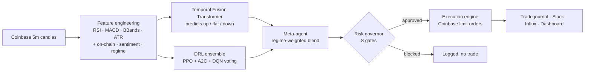
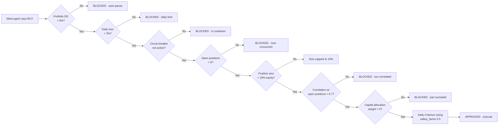
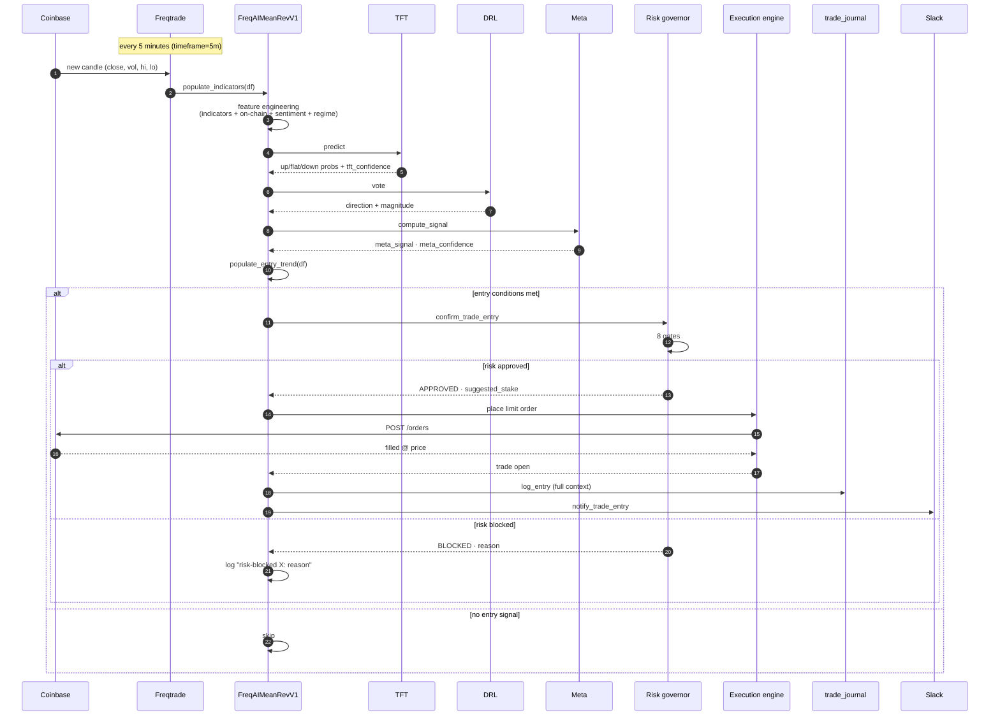
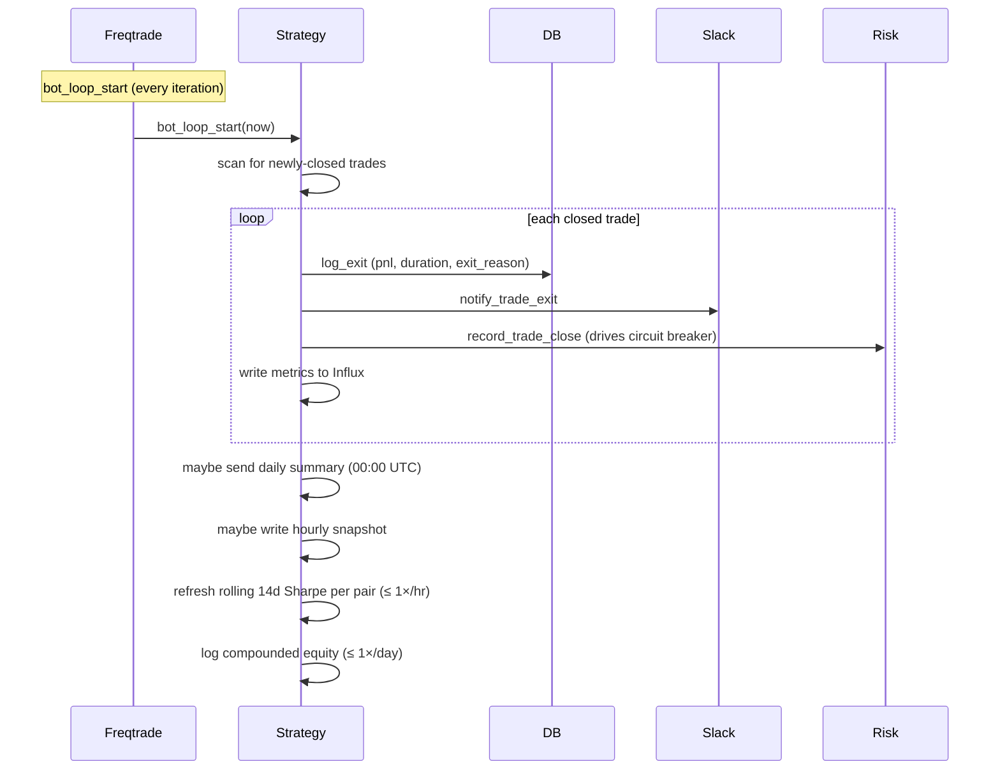

# Trading bot — TFT + DRL ensemble + EPT evolution

End-to-end algorithmic crypto trading system on top of [Freqtrade](https://www.freqtrade.io/),
with a custom Temporal Fusion Transformer model, a Deep-RL ensemble (PPO / A2C / DQN)
coordinated by a regime-aware meta-agent, evolutionary population training of full agent
genomes (EPT), a hard-gating risk governor, a Coinbase Advanced Trade execution engine,
Slack/Telegram/Grafana monitoring, an Ops console, and graduated go-live automation.

> **Status:** Paper trading on $19k Coinbase capital. Goal: $500–1000/month passive
> income. Hardware: NVIDIA DGX Spark (GB10 Blackwell, 128 GB unified memory).

---

## If you're new to algorithmic trading — start here

This bot makes lots of small bets in crypto markets, every 5 minutes. It tries to predict
whether the price of a coin will be up, down, or flat over the next ~30 minutes, and trades
on the predictions that look most confident. **It runs on your machine** — no cloud
dependency for the trading decisions themselves; only the news fetcher (Perplexity) and
the exchange (Coinbase) are external.

### Five things to know before reading further

| Concept | What it means here |
|---|---|
| **Paper trading** | The bot simulates trades against real market prices but doesn't actually buy or sell. Your real money is untouched. `dry_run: true` in `user_data/config.json` is the master switch. **Default on, stays on until you explicitly flip it via `./scripts/go_live.sh init`.** |
| **Sharpe ratio** | "Returns per unit of risk." Anything above 1.0 is decent; above 1.5 is the gate to go live; above 2.0 is excellent. Negative = losing money. |
| **Drawdown** | How far the account is below its peak. 8% drawdown means you're down 8% from the highest equity you ever had. The risk governor auto-pauses trading at 8% portfolio drawdown — that's the floor. |
| **Regime** | A market state the bot recognises: `trending_up`, `trending_down`, `mean_reverting`, `high_volatility`. Different regimes get different position sizes and confidence thresholds. |
| **TFT / DRL / EPT** | TFT is the price-direction predictor (transformer model). DRL is three reinforcement-learning agents that vote on whether to enter. EPT evolves whole strategy genomes (hyperparameters + features + risk knobs) generation by generation, keeping the best. |

### What the bot does, end to end



Every 5 minutes, every pair on the whitelist gets a fresh prediction. Most predictions
fail one or more gates — the risk governor only approves a small fraction. The ones that
pass become real (paper) trades.

### What the bot is NOT

- **Not a "set it and forget it" gold mine.** It needs paper-trading time to validate the
  model on live conditions before any real money is risked.
- **Not high-frequency trading.** 5-minute candle resolution. Maybe 5–20 trades per day
  total across all pairs.
- **Not a black box you can't audit.** Every trade entry records the TFT probabilities,
  DRL votes, sentiment score, regime, and the risk-governor decision in a Postgres table
  (`trade_journal`). You can replay why any trade fired.

---

## Repo layout

```
trading-bot/
├── docker-compose.yml             # postgres + freqtrade + influxdb + grafana + dashboard
├── start.sh                       # bring it all up
├── README.md                      # ← you are here
├── CHECKLIST.md                   # operator runbook (after-reboot checks, daily, emergency)
├── HERMES_SETUP_REPORT.md         # status of the Hermes Agent integration
├── .env.example                   # template — copy to .env and fill in keys
│
├── user_data/                     # ← bind-mounted into freqtrade + dashboard containers
│   ├── config.json                # all the knobs (regime_gating, risk_management, …)
│   ├── strategies/
│   │   └── FreqAIMeanRevV1.py     # the strategy class — bot_start, bot_loop_start,
│   │                              # populate_entry_trend, custom_stake_amount, etc.
│   ├── freqaimodels/
│   │   ├── TFTModel.py            # FreqAI wrapper for the TFT
│   │   └── tft_architecture.py    # the actual transformer model
│   ├── modules/                   # everything the strategy delegates to
│   │   ├── risk_governor.py       # the 8 hard gates
│   │   ├── meta_agent.py          # TFT + DRL → final signal
│   │   ├── ensemble_voter.py      # DRL voting logic
│   │   ├── drl_ensemble.py        # PPO/A2C/DQN container
│   │   ├── ept_evolution.py       # population, fitness, crossover, mutation
│   │   ├── regime_detector.py     # 4-state HMM
│   │   ├── sentiment_engine.py    # Perplexity → dual Hermes-3 (8B + 70B) on Ollama
│   │   ├── onchain_signals.py     # CryptoQuant + Whale Alert + Glassnode
│   │   ├── trade_journal.py       # Postgres writer for every entry/exit
│   │   ├── slack_alerts.py        # block-kit alerter
│   │   ├── metrics_writer.py      # Influx writer for Grafana
│   │   ├── monitoring_mixin.py    # consolidates Slack/journal/metrics into one mixin
│   │   └── db.py                  # centralised psycopg pool
│   ├── data/
│   │   ├── schema.sql             # TimescaleDB hypertables (trade_journal, regime_log,…)
│   │   └── coinbase/              # OHLCV cache (gitignored, populated on startup)
│   ├── dashboard/                 # FastAPI Ops dashboard (port 8081)
│   │   ├── app.py                 # main app + /api routes
│   │   ├── ops_routes.py          # /ops + /api/ops/* (services / training / regime / …)
│   │   ├── ops_probes.py          # service-health probes
│   │   ├── ops_db.py              # Postgres reads for the Ops panels
│   │   ├── mcp_local.py           # local shim for the 15 Hermes MCP tools
│   │   └── templates/, static/    # HTML + CSS + JS
│   └── logs/                      # freqtrade.log, hermes_mcp.log, evolution.json, …
│
├── hermes-mcp/                    # standalone MCP server (port 8089) for Hermes Agent
│   └── server.py                  # the 15 tools + auth
│
├── scripts/
│   ├── freqtrade_entrypoint.py    # exports Coinbase JSON key as env vars at boot
│   ├── go_live.sh                 # graduated tradable_balance_ratio (0.10 → 0.30 → …)
│   ├── validate_readiness.py      # checks Sharpe / DD / PF / win-rate / trades
│   ├── rebalance_capital.py       # 14-day Sharpe-driven pair_weights rebalance
│   ├── train_drl.py               # offline EPT cycle
│   ├── backup.sh                  # pg_dump + Hermes state + config snapshots
│   ├── emergency_stop.sh          # pause / cancel / snapshot / alert
│   └── auto_rollback.sh           # graduated rollback to dry-run on bad day
│
├── grafana/                       # provisioned datasources + dashboards
└── tests/                         # pytest suite (pure-Python smokes; no live keys needed)
```

---

## Architectural layers

```mermaid
flowchart TB
    subgraph Inputs
        C1[Coinbase OHLCV]
        C2[Perplexity news]
        C3[CryptoQuant<br/>Whale Alert<br/>Glassnode]
    end
    subgraph "1. Feature engineering"
        F1[Indicators<br/>RSI · MACD · BB · ATR]
        F2[Sentiment<br/>dual Hermes-3]
        F3[On-chain<br/>netflow · MVRV · whales]
        F4[Regime<br/>4-state HMM]
    end
    subgraph "2. AI brain"
        T[Temporal Fusion Transformer<br/>VSN → LSTM → Attention → quantile head<br/>up/flat/down + tft_confidence]
    end
    subgraph "3. DRL ensemble"
        D1[PPO]
        D2[A2C]
        D3[DQN]
        V[ensemble_voter<br/>direction-majority + magnitude-mean]
        D1 --> V
        D2 --> V
        D3 --> V
    end
    subgraph "4. Meta-agent"
        M[regime-weighted blend<br/>trending → TFT 0.6 / DRL 0.4<br/>mean-rev → 0.4 / 0.6<br/>high-vol → both must agree]
    end
    subgraph "5. Risk governor + execution"
        R{8 hard gates}
        E[Coinbase Advanced Trade<br/>limit-orders-only<br/>0.30% slippage gate]
    end
    subgraph "6. EPT evolution"
        P[8-genome population<br/>elites + children + newcomers]
        FIT[fitness =<br/>sharpe · dd_clip · pf · sqrt&#40;trades/50&#41;]
        P --> FIT --> P
    end
    subgraph "7. Monitoring"
        S[Slack alerts]
        J[trade_journal in Postgres]
        I[InfluxDB → Grafana]
        DASH[Ops dashboard :8081]
    end

    C1 --> F1
    C2 --> F2
    C3 --> F3
    C1 --> F4
    F1 --> T
    F2 --> T
    F3 --> T
    F4 --> T
    F1 --> D1 & D2 & D3
    F4 --> M
    T --> M
    V --> M
    M --> R
    R --> E
    E --> S & J & I
    P -.-> T
    P -.-> D1
    J --> DASH
```



### 1. Feature engineering

- **Price-derived** (`feature_engineering_expand_all`): RSI, ATR, Bollinger width / pct,
  MACD, volume-SMA-ratio, normalised close, returns. Expanded across multiple periods +
  timeframes for the TFT to learn from.
- **On-chain** (`modules/onchain_signals.py`): exchange net-flow z-score (CryptoQuant),
  MVRV ratio (Glassnode), whale-transaction count + volume (Whale Alert). 5-minute cache.
- **Sentiment** (`modules/sentiment_engine.py`): Perplexity Sonar fetches recent crypto
  headlines; **two local Hermes-3 models** (8B fast + 70B deep) score them in parallel
  via Ollama; "trust the majority" voter picks the consensus signal. Local-first — no
  prompts about your trades ever leave the Spark. 15-minute cadence.
- **Regime** (`modules/regime_detector.py`): 4-state HMM over BTC 1h returns.
  Refits every 24h, predicts every 5 min. Labels: `trending_up`, `trending_down`,
  `mean_reverting`, `high_volatility`.

### 2. Temporal Fusion Transformer

- VSN with per-variable Gated Residual Networks → LSTM encoder w/ skip-GLU →
  static enrichment GRN → 4-head causal self-attention → quantile head emitting
  P10 / P50 / P90.
- Output: 3-class probability (`down` / `flat` / `up`) + `tft_confidence = 1 / (1 + |P90 − P10|)`.
- Training: AdamW + warmup + cosine LR + AMP + early-stop on validation Sharpe +
  `torch.compile(reduce-overhead)`.
- Cadence: retrains every 24h on a 730-day sliding window, conv_width 60.
- GPU memory: capped to 30% (~38 GB) of the Spark's unified pool — leaves room for
  ModelForge + the Hermes-3 70B/8B sentiment models running in parallel.

### 3. Deep RL ensemble

- PPO + A2C + DQN trained on a custom Gymnasium env (17-dim observation vector,
  `Discrete(5)` action space — `{strong_sell, sell, hold, buy, strong_buy}` —
  differential-Sharpe reward).
- `ensemble_voter.vote()` does direction-majority + magnitude-mean of the agreers; if
  all three disagree, the vote is "hold" with zero confidence.
- Retrain cadence: weekly via `scripts/train_drl.py` (cron-driven).

### 4. Meta-agent

`compute_signal()` blends TFT and DRL using regime-aware weights:

| Regime | TFT weight | DRL weight | Notes |
|---|---|---|---|
| `trending_up` | 0.6 | 0.4 | TFT leads in trends |
| `trending_down` | 0.6 | 0.4 | (long-only — entries blocked here) |
| `mean_reverting` | 0.4 | 0.6 | DRL leads in choppy markets |
| `high_volatility` | both | both | **must agree** (DRL not all-disagree, signs match) |
| `unknown` | conservative | conservative | low size factor |

Output: `meta_signal ∈ {-1, 0, +1}`, `meta_confidence ∈ [0, 1]`. The strategy uses both
to gate entries and size positions.

### 5. Risk governor + execution

`modules/risk_governor.py` is the **floor that's never crossed.** Eight gates run on
every entry attempt:



If a position closes and was the 5th consecutive loss, the **circuit breaker** activates
for 4 hours — no new entries on any pair until cooldown elapses.

`modules/execution_engine.py` is a Coinbase Advanced Trade limit-orders-only wrapper:
0.30% slippage gate via `get_best_bid_ask`, 3-attempt exponential-backoff retry,
60-second order timeout, partial-fill tracking.

### 6. Monitoring

- **Slack** (block-kit) — structured reports: daily P&L (00:00 UTC), weekly evolution
  (Sun 00:00 UTC), risk warnings (DD>5%) and CRITICAL (DD>8%), system errors.
- **Telegram** (when configured via `hermes-mcp/setup_telegram.sh`) — real-time trade
  alerts and interactive `/pause`, `/resume`, `/status`.
- **Postgres `trade_journal`** — every entry + exit with TFT probs, DRL votes, sentiment,
  regime, exit reason, reasoning string. The audit log of why every trade happened.
- **Influx + Grafana** — time-series panels for equity curve, drawdown, win-rate, regime
  distribution.
- **Ops dashboard (port 8081)** — see [Dashboard tour](#dashboard-tour) below.

### 7. EPT evolution

Population of trading-agent genomes (hyperparameters + feature subset + risk parameters
+ DRL voter weights). Each generation:

1. Score every genome by `fitness = sharpe · max(0, 1 − dd / 0.15) · profit_factor · √(trades / 50)`
2. Keep top-K elites
3. Breed children by tensor-wise weight crossover + log-blend learning rates +
   union-then-sample feature subsets
4. Mutate children with σ-decaying Gaussian noise
5. Inject random newcomers for diversity
6. Train + evaluate on the latest data window
7. Auto-demote: champion is replaced by runner-up if rolling 3-sample Sharpe < 0.5

Cadence (first 30 days, accelerated): **12h training + 24h evaluation = 36h per
generation**, population 12. After the first month, this can be relaxed to the original
24+48=72h cycle. Snapshots append to `user_data/logs/evolution.json`.

### 8. Capital allocation

`config.json[capital_allocation]` lets you concentrate capital on the strongest pairs:

```jsonc
"capital_allocation": {
    "mode": "performance_weighted",
    "min_sharpe_for_trading": 0.7,         // pairs below this are data-only
    "pair_weights": {
        "BTC/USD":   0.40,                  // max 40% of equity in BTC at any time
        "ETH/USD":   0.40,
        "SOL/USD":   0.15,
        "ADA/USD":   0.05,
        "MATIC/USD": 0.00                   // excluded entirely
    },
    "rebalance_after_days": 14
}
```

Every 14 days, `scripts/rebalance_capital.py` (or the **Rebalance** button on the Ops
dashboard) rebalances weights based on each pair's live 14-day Sharpe. Pairs that haven't
generated trades yet keep their current weight (no false-signal redistribution).

The strategy reads `capital_allocation` from disk inside `bot_loop_start` (1×/hour), so
external rebalances take effect without a freqtrade restart.

---

## A trade's life — minute by minute



When the trade later closes (stop-loss, take-profit, or strategy exit signal):



---

## Dashboard tour

Open `http://localhost:8081/ops` after the stack is up. Eight panels in a single screen:

| Panel | What it shows | Where the data comes from |
|---|---|---|
| **Hero — regime + sentiment** | Current HMM regime (color-coded background), probability, time-in-regime. Sentiment score, agreement, headline count. Yellow warm-up banner if freqai isn't ready yet. | `regime_log` + `sentiment_log` |
| **Services** | 8 services up/down (ollama, hermes-mcp, hermes-gateway, hermes-dashboard, freqtrade, postgres, influxdb, grafana). Heartbeat-based for host services (firewall blocks docker→host on 8089/9119). | TCP/HTTP probes + heartbeat files |
| **Training** | freqai readiness (`pair_dictionary.json` written?), per-pair training status (done/training/queued, last epoch, val_sharpe, early-stop tag), ETA for first trade. | `freqtrade.log` parser |
| **MCP wire** | Endpoint, transport, last tool call from the audit log. | heartbeat + `hermes_mcp.log` |
| **Pair sparklines** | Per-pair card: 24h price sparkline + regime-color band + sentiment line. | freqtrade `/api/v1/pair_candles` + `regime_log` + `sentiment_log` |
| **Trades + risk** | Open positions, daily P&L, 30-day max drawdown, breaker state, recent closes. | freqtrade API + `trade_journal` |
| **Quick actions** | One-click MCP-routed buttons: Pause / Resume / Trigger EPT / Risk status / Regime check / Validate readiness / Rebalance capital. | `/api/ops/mcp/*` shim |
| **Slack preview** | Live render of what the next daily-P&L Slack message will look like. | aggregated `trade_journal` for today + `regime_log` 24h |
| **Why this trade fired or didn't** | Last 5 decisions for the selected pair: TFT probs, DRL votes, meta confidence, sentiment, regime, risk-governor verdict. | `trade_journal` (entered) + `freqtrade.log` parsed for "risk-blocked" lines (didn't fire) |
| **Regime parameters** | Editable per-regime entry/exit deltas + scalar tunables (stake factors, take-profit, trail, confidence floors). Each save: validated → backed up → atomic-write → freqtrade reload. | `config.json[regime_gating]` |
| **MCP tool console** | Typeahead of all 15 tools with auto-built parameter forms; JSON output viewer; last-10 call history. | `/api/ops/mcp/*` shim |

Color conventions:

- **Green** — healthy / OK / positive
- **Amber** — degraded / stale / warning threshold
- **Red** — down / failed / critical
- **Regime tile background** — green=trending_up, red=trending_down, amber=mean_reverting, purple=high_volatility

There's also a **TradingView-style chart page** at `http://localhost:8081/` (the root)
with full candle chart, VWAP/EMA overlays, regime-shaded segments, and entry/exit
markers from the trade journal.

---

## Quickstart

### 1. Prereqs

- Docker + Docker Compose
- Ollama running on the host with `OLLAMA_HOST=0.0.0.0` and `hermes3:8b` + `hermes3:70b`
  pulled (`ollama pull hermes3:8b && ollama pull hermes3:70b`)
- A Coinbase Advanced Trade account with API access (only needed when going live)
- A Slack workspace + incoming webhook (optional but recommended)
- Perplexity API key (optional — disables sentiment-from-news if absent)

### 2. Configure secrets

```bash
cp .env.example .env
chmod 600 .env
# Fill in:
#   SLACK_WEBHOOK_URL                         (alerts)
#   PERPLEXITY_API_KEY                        (news fetcher; Ollama scores locally)
#   POSTGRES_PASSWORD                         (anything strong)
#   INFLUX_TOKEN                              (`openssl rand -hex 32`)
#   INFLUX_ADMIN_PASSWORD
#   GRAFANA_ADMIN_PASSWORD
#   FREQTRADE_API_PASS                        (`openssl rand -hex 24`)
#   FREQTRADE_JWT_SECRET                      (`openssl rand -hex 32`)
#   FREQTRADE_WS_TOKEN                        (`openssl rand -hex 16`)
#   HERMES_MCP_KEY                            (`openssl rand -hex 32`)
```

**Coinbase API key** (only needed when you flip out of dry-run):

1. https://www.coinbase.com/settings/api → **New API Key**
2. Grant **View** + **Trade** on the portfolio you want the bot to use
3. Set an **IP allowlist** to your Spark host's outbound IP
4. Coinbase emits a JSON download — save it as **`secrets/coinbase.json`**

`scripts/freqtrade_entrypoint.py` runs at container start, reads that file, and exports
its `name` and `privateKey` fields as `FREQTRADE__EXCHANGE__KEY` /
`FREQTRADE__EXCHANGE__SECRET`. Freqtrade's native env-var override mechanism then
injects them into `config.json[exchange]` at runtime — **you never paste secrets into
config.json**.

`dry_run: true` is the default in `config.json` — no real-money trades until you flip it.

### 3. Bring up the stack

```bash
docker compose up -d --build
```

Services that come up:

| Service | Port | What it does |
|---|---|---|
| `postgres` | 5434 | PostgreSQL + TimescaleDB (`tradebot` + `freqtrade` DBs) |
| `freqtrade` | 8080 | trading bot (FreqAI + TFT + DRL + risk + execution) |
| `influxdb` | 8086 | time-series metrics consumed by Grafana (deprecation planned) |
| `grafana` | 3000 | observability dashboards (auto-provisioned) |
| `dashboard` | 8081 | TradingView-style chart at `/` + Ops console at `/ops` |

> **Note**: port `5434` (not `5432`) avoids conflicting with another local Postgres
> instance. Internal compose-network traffic uses `5432` — the host-mapped 5434 is only
> relevant when connecting from the host itself.

### 4. Watch the warm-up

The bot starts in `dry_run: true`. Until freqai finishes its **first full training cycle
across all 4 pairs**, predictions will be null and no trades will fire. This typically
takes 3–4 hours from a clean start (BTC → ETH → SOL → ADA, each ~30–60 min, with early
stopping).

Open `http://localhost:8081/ops` and watch the **Training panel**. The warm-up banner
on the regime hero tile will go away the moment `pair_dictionary.json` lands and
predictions start flowing. **First trade ETA** is shown in the panel.

### 5. Paper-trade until ready

Once the first trade fires, the bot accumulates a journal of decisions and outcomes.
After ~7 days of activity, click the **"Validate readiness"** button on the Ops
Quick-Actions panel (or run `python3 scripts/validate_readiness.py` on the CLI).

| Mode | Sharpe | MaxDD | PF | Trades | Days |
|---|---|---|---|---|---|
| **Standard** | > 1.5 | < 12% | > 1.4 | ≥ 200 | 28+ |
| **Fast-track** | > 1.2 | < 8% | > 1.5 | ≥ 80 | 7+ |

Standard is the default; fast-track is tighter on DD/PF (compensating for the smaller
sample) and lets you graduate after one good week.

### 6. Go live (graduated)

```bash
./scripts/go_live.sh init             # standard:  0.10 → 0.30 → 0.50 → 0.99 over 7/14/30 days
FAST_TRACK=1 ./scripts/go_live.sh init  # fast-track: 0.15 → 0.40 → 0.75 → 0.99 over 4/7/14 days
./scripts/install_crontab.sh           # arm hourly safety net + nightly backups
```

Each subsequent week, run `./scripts/go_live.sh advance` — refuses unless **both** the
time gate AND PnL gate are green.

### 7. Emergency stop

```bash
./scripts/emergency_stop.sh "reason text"
```

Flips to dry-run, cancels open orders, snapshots state, alerts Slack. Or use the **Pause
trading** button on the Ops dashboard (same outcome, audited via `hermes_mcp.log`).

---

## Daily / weekly / monthly operations

### Every morning (5 minutes over coffee)

| Where | What to check | Threshold |
|---|---|---|
| Slack `:bar_chart:` daily report | Net P&L, Sharpe-30d, MaxDD-30d | DD < 8%, Sharpe trending up |
| `http://localhost:8081/ops` regime hero | Current regime + warm-up banner | If banner is yellow > 12h, restart freqtrade |
| Ops trades panel | Open count, daily P&L, breaker state | Breaker should say `clear` |
| Ops services panel | All 8 services green | Anything red = needs attention |
| `tail -50 user_data/logs/hermes_mcp.log` | MCP tool calls | No repeated 5xx or auth errors |

### Every Sunday (~30 min)

1. Read the weekly evolution Slack report (auto-fires Sun 00:00 UTC).
2. `./scripts/backup.sh weekly` — creates `~/backups/trading-bot/weekly/<stamp>.tar.gz`
   with config + models + Hermes state + pg_dump.
3. Click **"Validate readiness"** on Ops dashboard — see how close you are to fast-track
   or standard graduation.
4. Skim the `.hermes/skills/` directory — Hermes Agent may have auto-created a skill
   from a recurring pattern. Read it; keep useful ones, delete noise.
5. `df -h /var/lib/docker /home` — Postgres hypertables grow ~50 MB/day. Act if < 20 GB
   free.

### Every other Tuesday (auto-fires; no operator action needed)

The `capital_rebalance_14d` Hermes cron runs `scripts/rebalance_capital.py`, recomputes
pair weights based on each pair's live Sharpe, atomic-writes `config.json`, and posts a
Slack summary with old → new weights.

If you want to preview the rebalance before it fires automatically, click **"Rebalance
capital · dry-run"** on the Ops dashboard.

### Emergency response

Section D of `CHECKLIST.md` has the playbook. Quick reference:

| Symptom | What to do |
|---|---|
| Position you don't like | Click **Pause trading** on Ops; investigate; **Resume trading** when ready |
| Drawdown approaches 8% | Risk monitor cron alerts on Slack/Telegram; governor auto-pauses at 8% |
| Flash crash detected (>5% in 60s) | `flash_crash_defense.md` skill kicks in automatically; Telegram CRITICAL alert fires |
| Ollama using too much memory | `sudo systemctl restart ollama`; cgroup caps prevent runaway |
| MCP wire dead | `systemctl restart hermes-mcp`; verify `hermes mcp list` shows trading-bot ✓ |
| Container unhealthy | `docker compose logs <service>`; `docker compose restart <service>` |

---

## Tests

Pure-Python smoke tests with no external dependencies (no live keys, no network
requirement except where noted):

```bash
pytest tests/ --ignore=tests/test_onchain.py --ignore=tests/test_regime.py
# 48 tests covering: TFT, DRL, EPT evolution, risk governor, monitoring, dashboard,
# Ops endpoints, sentiment engine. Some tests skip themselves when Postgres or
# external APIs aren't reachable; that's intentional.
```

---

## Configuration reference

All knobs live under named blocks in `user_data/config.json`:

| Block | Owns |
|---|---|
| `dry_run` (top-level) | Master paper/live switch |
| `dry_run_wallet` | Starting equity for paper trading ($19000) |
| `tradable_balance_ratio` | Fraction of wallet exposed (graduated by `go_live.sh`) |
| `max_open_trades` | Hard cap on simultaneous positions |
| `minimal_roi` | Time-decayed take-profit ladder |
| `freqai.feature_parameters` | Timeframes, indicator periods, label horizon |
| `freqai.model_training_parameters` | TFT hidden size, heads, dropout, AMP, compile, batch, epochs, early-stop |
| `regime_gating` | Per-regime entry/exit threshold deltas, stake factors, confidence floors. Editable via the Ops dashboard. |
| `risk_management` | The 8 governor limits (DD%, daily loss, breaker, Kelly knobs, correlation threshold) |
| `capital_allocation` | Per-pair weights, min Sharpe for trading, rebalance cadence |
| `ept_evolution` | Population, elites, mutation σ, generation cadence |
| `execution` | Slippage / retry / timeout knobs |

Most blocks support runtime overrides via `FREQTRADE__BLOCK__KEY` env vars.

---

## Glossary

| Term | Meaning |
|---|---|
| **Annualised Sharpe** | Daily Sharpe × √365. Anything above 1.0 means the strategy beats the risk-free rate in a year. |
| **Backtest** | Replay historical candles through the strategy to estimate past performance. **Past results do not guarantee future ones**, but a strategy that fails backtests will fail live too. |
| **Candle** | One timeframe's worth of OHLCV data (open / high / low / close / volume). Our timeframe is 5 minutes. |
| **Circuit breaker** | After 5 consecutive losing trades, no new entries for 4 hours. Catches strategy degradation before it cascades. |
| **DRL ensemble** | Three reinforcement-learning agents (PPO, A2C, DQN) that vote on whether to enter. If they all disagree, hold. |
| **dry_run** | Paper trading mode. The bot makes "fake" trades against real prices to validate the strategy without risk. |
| **EPT** | Evolutionary Population Training. A population of full strategy genomes (hyperparams + features + risk knobs) is scored, bred, mutated, and culled every generation. |
| **freqai** | Freqtrade's machine-learning extension. Manages the train/predict lifecycle for the TFT model. |
| **HMM** | Hidden Markov Model. The regime detector's underlying algorithm — fits 4 hidden states to BTC's hourly returns. |
| **Kelly Criterion** | Mathematical formula for the optimal bet size given win probability + payoff ratio. We apply it with a 0.5 safety factor (= half-Kelly). |
| **MCP** | Model Context Protocol — Anthropic's standard for tool calling. Hermes Agent uses MCP to call into the trading bot for status + control. |
| **Meta-agent** | Combines TFT and DRL into one signal, weighted by the current regime. |
| **Profit factor** | Sum(winning trades) / |Sum(losing trades)|. >1 = profitable, >1.4 = decent. |
| **Regime** | A market state. The strategy adjusts position sizing + thresholds per regime. |
| **risk governor** | The rule-engine that vetoes trades. The 8% portfolio-DD floor is the absolute backstop. |
| **Sharpe ratio** | (mean return − risk-free) / stdev of returns. A unitless measure of risk-adjusted performance. |
| **TFT** | Temporal Fusion Transformer. The price-direction predictor. |
| **trade_journal** | Postgres table that records every entry + exit with full context. The audit log of why every trade happened. |
| **VWAP / EMA** | Volume-Weighted Average Price / Exponential Moving Average. Reference levels shown on the chart. |

---

## License + acknowledgements

- Built on top of [Freqtrade](https://github.com/freqtrade/freqtrade)
- TFT architecture inspired by Lim et al. 2019, *"Temporal Fusion Transformers for
  Interpretable Multi-horizon Time Series Forecasting"*
- DRL implementations from [Stable-Baselines3](https://github.com/DLR-RM/stable-baselines3)
- Charting via TradingView's [Lightweight Charts](https://github.com/tradingview/lightweight-charts)
- MCP via Anthropic's [reference Python SDK](https://github.com/modelcontextprotocol/python-sdk)

This is **research code for personal use**. Trade live at your own risk; the authors take
no responsibility for losses.
