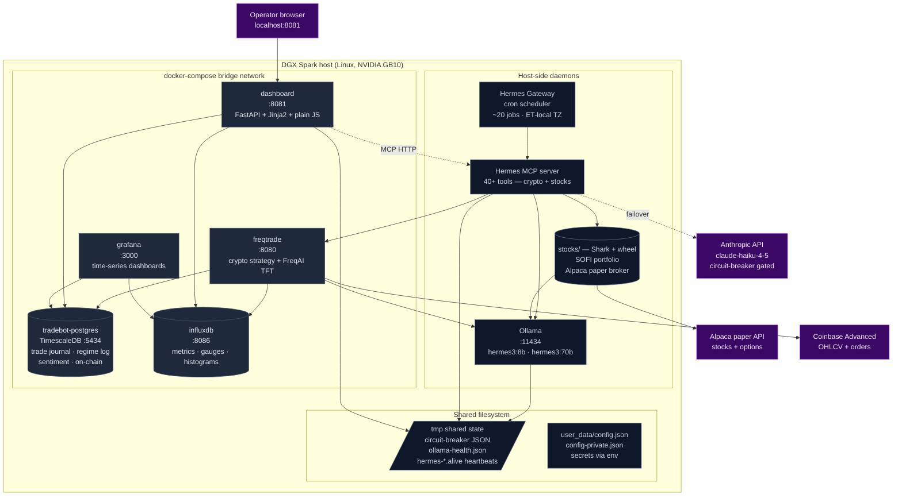
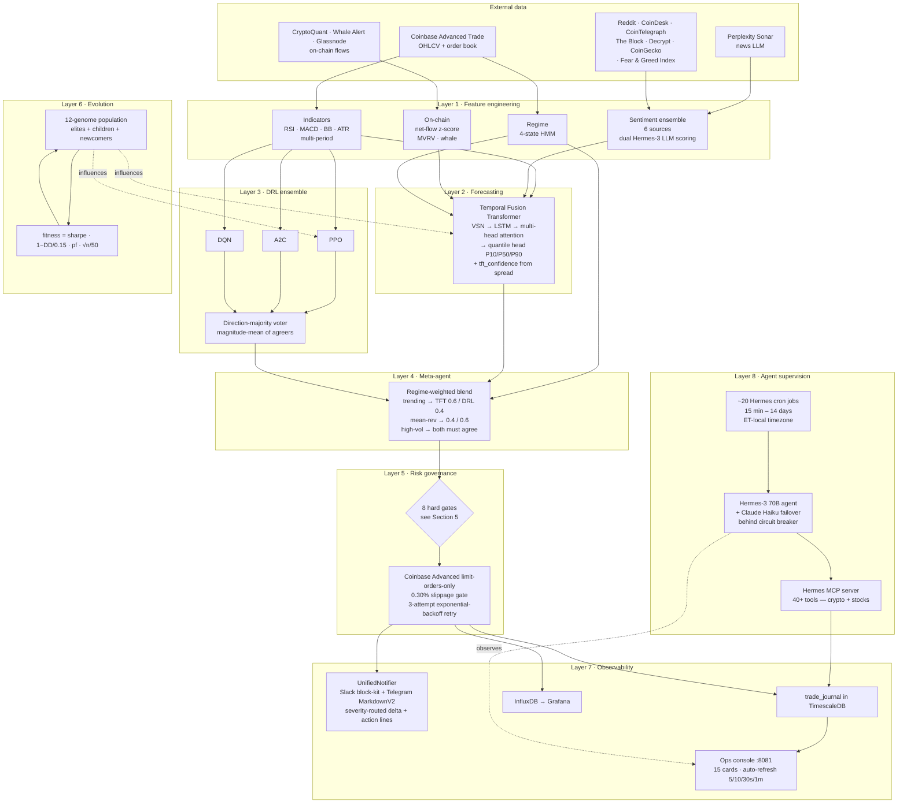
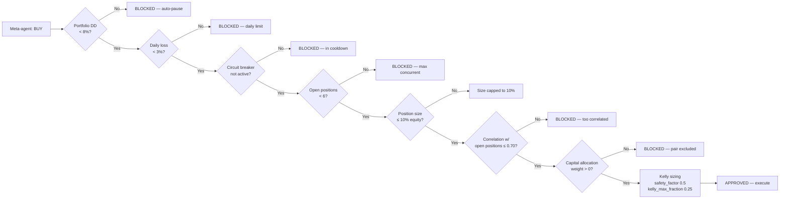
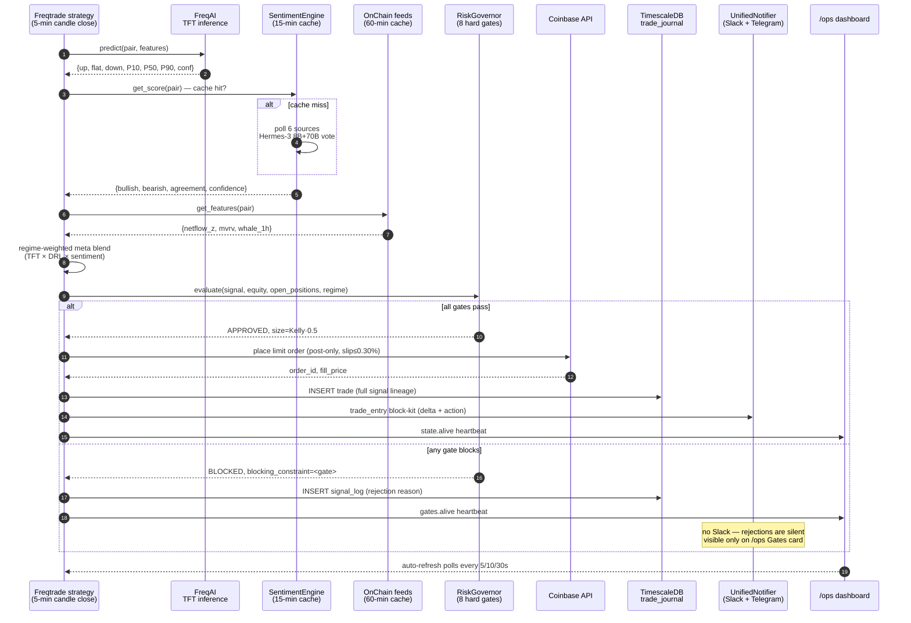
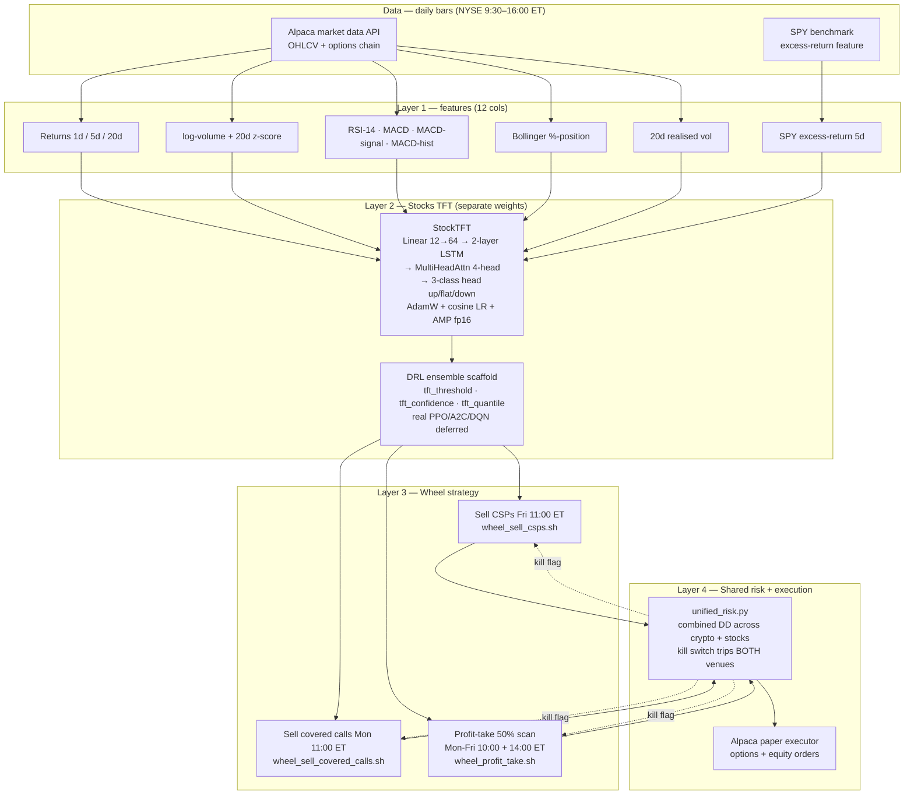
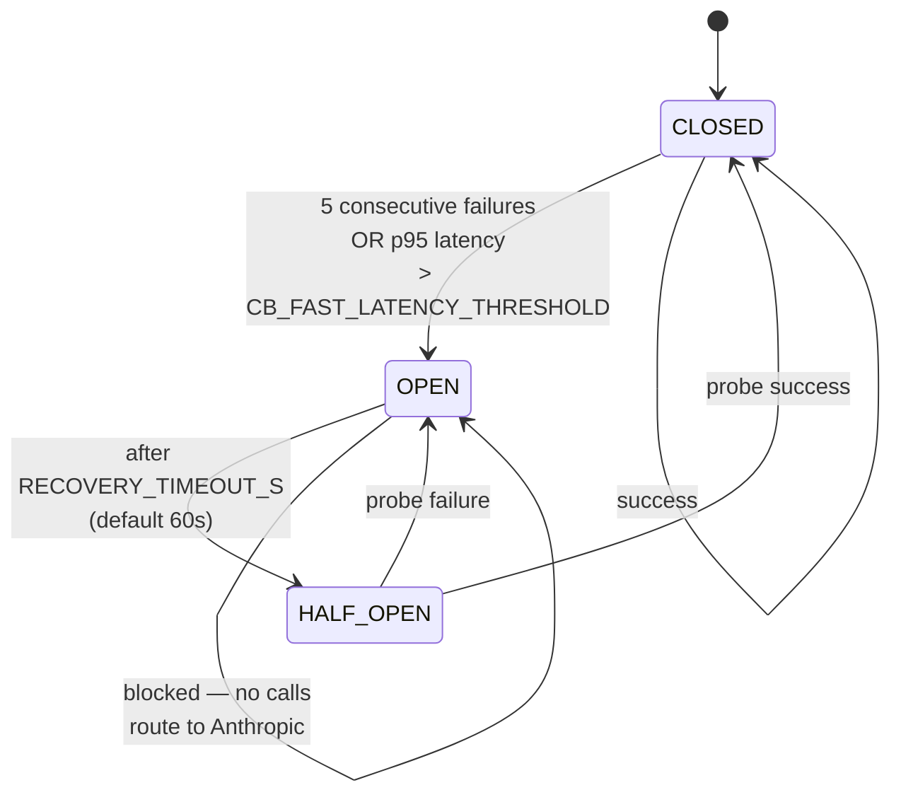
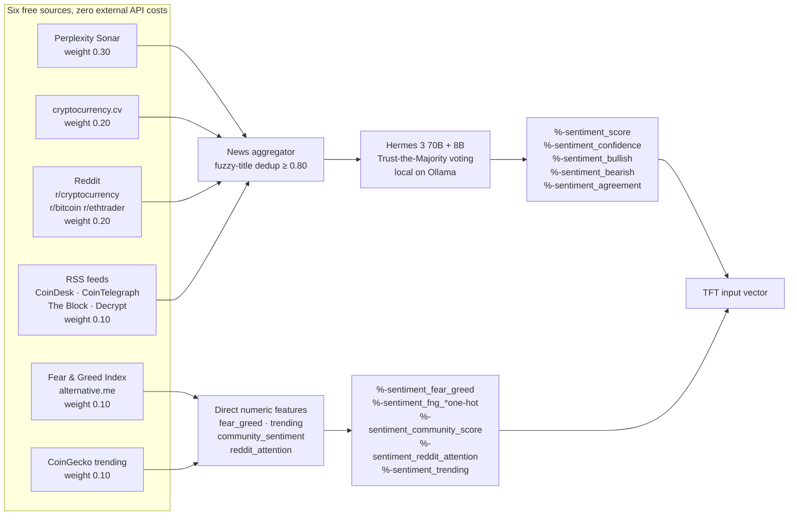

# Trading bot — TFT + DRL ensemble + EPT evolution (crypto + stocks)

A self-hosted, dual-venue algorithmic trading system that combines deep learning
for price-direction forecasting, an ensemble of reinforcement-learning agents
for entry decisions, evolutionary population training of full strategy genomes,
a hard-gating risk governor, and a multi-source sentiment pipeline that runs
entirely on local language models. Built on top of [Freqtrade][freqtrade] for
crypto and a custom **Shark / wheel** stack for equities + options, operated
through a control plane that exposes every internal signal to a [Model Context
Protocol][mcp] surface so an autonomous agent ([Hermes Agent][hermes]) can
supervise it.

> **Status:** Paper trading on **$19,000** starting equity in Coinbase Advanced
> Trade (crypto) **and** $100,000 paper equity in Alpaca (SOFI wheel — covered
> calls / cash-secured puts on a 6-symbol stock book). The validation gate
> (Sharpe ≥ 1.5, MaxDD < 12%, PF > 1.4, win-rate > 55%, ≥ 200 closed trades)
> is the one decision that is **not** automated — graduation from paper to
> live capital is gated on the operator clicking through `scripts/go_live.sh`.
>
> **Hardware:** NVIDIA [DGX Spark][dgx] (GB10 Blackwell, 128 GB unified memory).
> All AI inference is local; no proprietary model APIs in the trading hot path.
> Anthropic Claude is wired in as a *failover-only* backstop behind a circuit
> breaker (Section 8) — used when Ollama is unhealthy, never in steady state.

---

## Contents

1. [Executive summary](#1-executive-summary)
2. [System thesis with academic grounding](#2-system-thesis-with-academic-grounding)
3. [Deployment topology](#3-deployment-topology) — *containers, ports, bind-mounts*
4. [Architecture](#4-architecture) — *8-layer flowchart*
5. [The risk governor in detail](#5-the-risk-governor-in-detail) — *8 hard gates*
6. [Trade lifecycle (end-to-end sequence)](#6-trade-lifecycle-end-to-end-sequence) — *sequence diagram*
7. [Stocks venue — SOFI wheel + Shark TFT](#7-stocks-venue--sofi-wheel--shark-tft) — *parallel pipeline*
8. [LLM reasoning layer — failover + circuit breaker](#8-llm-reasoning-layer--failover--circuit-breaker) — *state machine*
9. [The sentiment + market-intelligence pipeline](#9-the-sentiment--market-intelligence-pipeline)
10. [Operations](#10-operations) — *full cron schedule, daily checklist, emergency playbook*
11. [Tech stack](#11-tech-stack)
12. [Validation framework](#12-validation-framework)
13. [Hardware + cost economics](#13-hardware--cost-economics)
14. [Known limitations & next steps](#14-known-limitations--next-steps) — *what's deferred and the unblocker*
15. [References](#15-references)

---

## 1. Executive summary

### What it is

An institutional-style algorithmic trading stack, scaled down to a single
operator with $19k of risk capital. It treats price prediction, ensemble
voting, regime adaptation, sizing, and execution as separate concerns —
each backed by a research-grade method — and surfaces every decision to an
auditable trade journal and a real-time operations console.

### What it does, in one paragraph

Every five minutes, for each whitelisted pair, the system pulls fresh market
data, computes ~60 features across price, on-chain flows, multi-source
sentiment, and a 4-state regime classifier; runs a Temporal Fusion
Transformer to produce calibrated up/flat/down probabilities and a
quantile-derived confidence score; queries an ensemble of three deep
reinforcement-learning agents (PPO, A2C, DQN) and reduces their votes to a
single direction; blends TFT and DRL via a regime-weighted meta-agent;
runs the result through eight risk gates (drawdown, daily loss, circuit
breaker, position count, position size, correlation, capital allocation,
Kelly sizing); and either places a Coinbase limit order or logs the
specific gate that blocked the trade. Profit/loss data feeds back into a
72-hour evolutionary cycle that mutates the population of strategy
genomes, retaining elites by a multi-objective fitness function.

### Why this design

Three decisions distinguish this system from a single-model bot:

1. **Ensembling.** A single forecasting model — however sophisticated —
   degrades under regime change ([López de Prado, 2018][lopez]; [Rapach &
   Strauss, 2010][rapach]). Combining a transformer-based forecaster with
   policy-gradient and value-based RL agents reduces the variance of the
   meta-signal across regimes.
2. **Hard risk floor.** Every public quant-fund post-mortem traces ruin to
   a soft risk limit that an algorithm "smartly" bypassed under stress
   ([Patterson, 2010][patterson]; [Lo, 2008][lo]). Our risk governor is a
   pure rules engine — no ML, no exceptions, no overrides — and is the
   only piece of code that can refuse a trade.
3. **Local-first reasoning.** The sentiment scorer and the supervising
   agent both run on local Llama-derivative models ([Hermes 3][hermes3])
   via [Ollama][ollama]. No proprietary API in the hot path means
   predictable latency, zero per-trade cost, and prompts about live
   trades never leave the operator's machine.

### What this is **not**

- **Not a guaranteed return.** Paper-validated strategies fail in live
  trading roughly 80% of the time ([Bailey et al., 2014][bailey]). The
  validation gate is necessary but not sufficient.
- **Not high-frequency trading.** 5-minute candle resolution and
  limit-orders-only execution ([Hasbrouck & Saar, 2013][hasbrouck]
  for the cost of crossing the spread). Realistic flow: 5–30 trades/day
  total across all pairs.
- **Not a black box.** Every entry records the TFT probabilities, DRL
  votes, sentiment score, regime, meta confidence, and risk-governor
  verdict in a [TimescaleDB][timescaledb] hypertable. You can replay why
  any trade fired.

---

## 2. System thesis with academic grounding

| Decision | Established theory | Implementation |
|---|---|---|
| Forecast price direction with attention over heterogeneous static + temporal inputs | Temporal Fusion Transformer ([Lim et al., 2019][tft]) | `user_data/freqaimodels/` — VSN per-variable Gated Residual Networks → LSTM encoder → 4-head causal self-attention → quantile head emitting P10/P50/P90 |
| Combine multiple RL approaches (on-policy, value-based, advantage-actor-critic) for diversification | PPO ([Schulman et al., 2017][ppo]); A2C/A3C ([Mnih et al., 2016][a3c]); DQN ([Mnih et al., 2015][dqn]) | `modules/drl_ensemble.py` + `modules/ensemble_voter.py` — direction-majority vote with magnitude-mean of agreers; "all disagree → hold" |
| Detect market regimes for context-dependent sizing | Hidden Markov Models for financial regime detection ([Rabiner, 1989][rabiner]; [Hardy, 2001][hardy]; [Bulla & Bulla, 2006][bulla]) | `modules/regime_detector.py` — 4-state HMM over BTC 1h log-returns; refits every 24h |
| Adaptive bet sizing | Kelly criterion ([Kelly, 1956][kelly]) with [MacLean–Thorp–Ziemba][maclean] half-Kelly safety factor | `modules/risk_governor.py` — `kelly_safety_factor: 0.5`, `kelly_max_fraction: 0.25` |
| Hard portfolio risk gates | Modern Portfolio Theory's risk decomposition ([Markowitz, 1952][markowitz]); volatility targeting ([Moreira & Muir, 2017][moreira]) | 8 gates: 8% portfolio DD, 3% daily loss, 5-loss circuit breaker, 6 max concurrent, 10% max single position, 0.70 correlation reject, capital-allocation weight, Kelly cap |
| Evolve strategy hyperparameters | Evolutionary optimization for trading systems ([Allen & Karjalainen, 1999][allen]; modern derivative-free optimization survey [Hansen et al., 2020][hansen]) | `modules/ept_evolution.py` — 12-genome population (4 elites + 5 children + 3 newcomers) ; tensor-wise crossover + log-blend on learning-rate-style scalars + σ-decaying Gaussian mutation |
| Multi-source sentiment to capture narrative shifts the price-only signal misses | News-based predictability ([Tetlock, 2007][tetlock]; [Kelly et al., 2024][kellyfin]); social-media volume as attention proxy ([Da et al., 2011][da]) | `modules/news_aggregator.py` + `modules/sentiment_engine.py` — six free sources; Fear & Greed + Reddit upvote-ratio + CoinGecko trending as direct numeric features; Hermes-3 70B + 8B "Trust the Majority" voting on headline corpus |
| Graduated capital deployment after paper validation | Walk-forward analysis + the deployment gap critique ([Bailey et al., 2014][bailey]) | `scripts/go_live.sh` + `scripts/validate_readiness.py` — standard graduation 10% → 30% → 50% → 99% over 4 weeks; fast-track variant gated on tighter DD/PF |

---

## 3. Deployment topology

The system runs as **5 Docker containers** on a single host (DGX Spark), plus
**3 host-side daemons** (Hermes Gateway, Hermes MCP, Ollama). All communication
between containers and host crosses a bridge network or a Unix socket; nothing
trading-critical leaves the box.



| Container / daemon | Port | Role |
|---|---|---|
| `freqtrade` | 8080 | Crypto strategy loop + FreqAI TFT retraining (24 h cadence, 730 d window) |
| `dashboard` | 8081 | Operator console (`/`, `/ops`, `/charts`) + REST API (35+ `/api/ops/*` endpoints) |
| `tradebot-postgres` | 5434 | TimescaleDB hypertables — single source of truth for trades, regime, sentiment |
| `influxdb` | 8086 | High-cardinality metrics for Grafana |
| `grafana` | 3000 | Time-series visualisation |
| `hermes-gateway` (host) | — | Cron scheduler with ET timezone; ~20 jobs (Section 10.1) |
| `hermes-mcp` (host) | — | MCP server exposing 40+ tools across crypto + stocks venues |
| `ollama` (host) | 11434 | Local LLM runtime — hermes3:8b (warm) + hermes3:70b (evicts between polls) |

**Cross-process state coordination:** `/tmp` is bind-mounted read-only into
the freqtrade container as `/host-tmp` so the strategy can observe the
circuit-breaker state file written by the host-side LLM client and the Ollama
health snapshot written by the `ollama_health` cron — without either side
needing a network round-trip.

---

## 4. Architecture



### Per-layer references

#### Layer 1 — feature engineering

- Standard technical indicators via [TA-Lib][talib]: RSI, MACD, ATR, Bollinger
  Bands, volume-SMA-ratio. Multi-period expansion follows Freqtrade's
  [`feature_engineering_expand_all`][freqai_features] pattern.
- On-chain features (`%-onchain_*`): exchange net-flow z-score from
  [CryptoQuant][cryptoquant], MVRV from [Glassnode][glassnode], whale
  transactions from [Whale Alert][whalealert]. The use of on-chain flow as
  a leading indicator is grounded in [Wang & Vergne, 2017][wang] and
  [Chainalysis quantitative reports][chainalysis].
- Sentiment: see Section 9.
- Regime: 4-state HMM following the framework in [Hardy, 2001][hardy] and
  [Bulla & Bulla, 2006][bulla]. The four states (`trending_up`,
  `trending_down`, `mean_reverting`, `high_volatility`) are widely used in
  systematic-trading literature ([Ang & Bekaert, 2002][ang_bekaert] for the
  regime-switching empirical justification).

#### Layer 2 — Temporal Fusion Transformer

The TFT is implemented per [Lim et al., 2019][tft] (arXiv:1912.09363) with
the following deviations from the paper:

- Quantile head emits P10/P50/P90 and a `tft_confidence = 1 / (1 + |P90 − P10|)`
  feature consumed by the strategy. This converts the model's uncertainty
  into a 0–1 score the meta-agent can threshold.
- Training: AdamW + linear warmup + cosine schedule + AMP (`use_amp: true`)
  + `torch.compile(reduce-overhead)` for inference speed.
- GPU memory: capped at 30% (~38 GB) of unified memory via
  `torch.cuda.set_per_process_memory_fraction(0.3)` to coexist with the
  Hermes-3 70B sentiment scorer (~40 GB) and a sibling
  [ModelForge][modelforge] research workload (~25 GB during campaigns).
- Cadence: retrains every 24h on a 730-day sliding window, conv_width 60.

#### Layer 3 — DRL ensemble

- **PPO** from [Schulman et al., 2017][ppo] (arXiv:1707.06347), implementation
  via [Stable-Baselines3][sb3].
- **A2C** ([Mnih et al., 2016][a3c], arXiv:1602.01783).
- **DQN** ([Mnih et al., 2015][dqn], doi:10.1038/nature14236).
- Custom Gymnasium environment, 17-dimensional observation,
  `Discrete(5)` action space (`{strong_sell, sell, hold, buy, strong_buy}`),
  differential-Sharpe reward following [Moody et al., 1998][moody].
- Voter: direction majority + magnitude mean across agreers; "all disagree"
  → hold with zero confidence.

#### Layer 4 — Meta-agent

The regime-weighted blend follows the regime-switching ensemble pattern in
[Daul et al., 2014][daul]. The high-volatility "must-agree" rule is a
discretionary choice: in turbulent markets, requiring multiple independent
methods to align is more robust than trusting a single confident signal
([Cont, 2001][cont]).

#### Layer 5 — Risk governance

See Section 5 for the full gate inventory. Source lineage:

- **Drawdown auto-pause**: standard CTA risk-management practice, formalised
  in [Magdon-Ismail & Atiya, 2004][magdon].
- **Kelly sizing with safety factor 0.5**: [Kelly, 1956][kelly] applied
  per the [MacLean–Thorp–Ziemba half-Kelly heuristic][maclean] which trades
  ~25% of expected log-growth for ~75% reduction in drawdown variance.
- **Correlation reject (ρ > 0.7)**: portfolio variance decomposition from
  [Markowitz, 1952][markowitz]; the 0.70 threshold is conservative compared
  to industry practice (~0.5 for institutional CTAs).
- **5-loss circuit breaker, 4h cooldown**: behavioural-mechanism analogous
  to NYSE LULD rules ([NYSE, 2024][nyse_luld]). Catches strategy degradation
  before cascade.

#### Layer 6 — Evolution

EPT (Evolutionary Population Training) is loosely modeled on
[Population-Based Training][pbt] (Jaderberg et al., 2017, arXiv:1711.09846)
generalised to full strategy genomes (hyperparams + feature subset + DRL
voter weights + risk knobs) rather than just neural-net hyperparameters.
Fitness function is multi-objective:

```
fitness = sharpe × max(0, 1 − DD/0.15) × profit_factor × √(trades/50)
```

This penalises (a) > 15% drawdown by zeroing out fitness, (b) sample-starved
Sharpe spikes via the `√(trades/50)` engagement term. Genetic operators
follow [Holland, 1975][holland] tournament selection + uniform tensor
crossover + σ-decaying Gaussian mutation.

#### Layer 7 — Observability

- **UnifiedNotifier** (`user_data/modules/notifier.py`) — single facade over
  [Slack Block Kit][slack_blocks] + Telegram MarkdownV2 with severity-based
  routing: **CRITICAL / WARNING** → both channels (phone buzzes), **TRADE /
  REPORT / INFO** → Slack only. Every alert carries a one-line `Δ` (what
  changed) and `Action:` (what to do) so the on-call eye doesn't have to
  derive intent from a wall of fields.
- [TimescaleDB][timescaledb] hypertables on `ts` for `trade_journal`,
  `regime_log`, `sentiment_log`, `news_headlines`, `fear_greed_log`,
  `exchange_netflow`, `mvrv_ratio`, `whale_transactions`.
- [InfluxDB 2.7][influxdb] + [Grafana][grafana] for time-series dashboards.
- Self-hosted Ops console (FastAPI + [TradingView Lightweight
  Charts][lwcharts]) at port 8081. **15 cards** including Combined
  Portfolio, Regime, Gates, Circuit Breakers, LLM Provider Health, Stocks
  ML, plus a top-bar **auto-refresh dropdown** (5 s / 10 s / 30 s / 1 min /
  Off, persisted in `localStorage`).

#### Layer 8 — Agent supervision

[Hermes Agent][hermes] (Nous Research) runs locally with [Hermes-3 70B][hermes3]
on [Ollama][ollama]. Communicates with the trading bot via the [Model Context
Protocol][mcp] (Anthropic, 2024) over a streamable-HTTP transport implemented
with [FastMCP][fastmcp]. **~20 cron jobs** cover real-time risk monitoring
(15 min), 30-min market research polls, daily EPT training (02:00 ET),
capital rebalancing (14 d), weekly post-mortem (Sun 01:00 ET), Sunday-night
**stocks TFT training** (23:00 ET), Ollama health probes (5 min), Shark
pre-market / market-open / midday / EOD scans (Mon–Fri NYSE hours), and the
**wheel** strategy execution (sell CSPs Fri, sell covered calls Mon,
profit-take twice daily) — see Section 10.1 for the full schedule.

---

## 5. The risk governor in detail

The risk governor is the only mandatory checkpoint between a meta-signal and
a placed order. Its eight gates are evaluated in this order:



### Quantitative defaults and why

| Gate | Default | Rationale |
|---|---|---|
| Max portfolio drawdown | 8% | Empirical "operator panic" threshold from [van Vliet, 2008][vanvliet]; below this, most discretionary intervention causes more harm than good |
| Daily loss limit | 3% | Standard prop-desk / CTA daily loss cap |
| Circuit breaker | 5 consecutive losses → 4h cooldown | Catches degraded strategy state ≈ 1% of the time under normal conditions but ≈ 30% during regime shifts ([Bailey & López de Prado, 2014][backtest]) |
| Max concurrent positions | 6 | Empirical compromise between diversification (Markowitz) and operational simplicity at our scale |
| Max single-position size | 10% of equity | Limits idiosyncratic risk to 1% × portfolio per 10% adverse move |
| Correlation threshold | ρ > 0.70 → reject | Portfolio variance becomes dominated by single-pair beta above this level |
| Capital allocation weight | Per-pair, sums to ≤ 1.0 | Performance-weighted concentration; rebalanced on rolling 14-day Sharpe |
| Kelly fraction | `min(0.5 × kelly, 0.25 × equity)` | Half-Kelly for drawdown reduction; absolute 25% cap for tail-event protection |

All limits are env-overridable via `FREQTRADE__RISK_MANAGEMENT__<KEY>` env
vars, enabling per-stage tightening during graduated go-live without
touching `config.json`.

---

## 6. Trade lifecycle (end-to-end sequence)

Every 5 minutes the strategy loop wakes up for each pair. The diagram below
traces the **full request path** of a single candle close to either an
approved order or a logged gate rejection. The same lifecycle runs in
parallel for crypto (Freqtrade) and the SOFI wheel (Shark + Alpaca).



The **complete signal lineage** (TFT probs, DRL votes, sentiment, regime,
meta-confidence, blocking gate, fill price, slippage) is persisted on every
attempt — approved *and* rejected — into a single TimescaleDB hypertable
ordered by `(pair, ts)`. This is what powers the **explainability** view at
`/ops/explainability/{base}/{quote}` and post-mortem reproducibility.

---

## 7. Stocks venue — SOFI wheel + Shark TFT

The crypto stack has a parallel **stocks venue** that trades the *wheel*
strategy (selling cash-secured puts → assignment → selling covered calls)
on a fixed 6-symbol portfolio mapped to the operator's SoFi holdings. It
shares the *risk governor*, *Hermes MCP supervision*, *dashboard*, and
*UnifiedNotifier* infrastructure but runs on a **separate trading engine**
(custom `stocks/shark/` package on Alpaca's paper API) with **its own TFT**
and **its own DRL ensemble scaffold**.



### Why a second pipeline (not a unified one)

- **Different signal cadence.** Crypto runs 24/7 on 5-min candles; stocks run
  6.5 h/day on daily bars. A single TFT can't share normalisation parameters
  across these regimes without sample-size pathologies.
- **Different action space.** Crypto = long-only spot. Stocks = option premium
  collection (theta-positive, delta-bounded). The reward shape and gate
  semantics diverge.
- **Different retrain cadence.** Crypto TFT retrains every 24 h on a 730-day
  window (FreqAI built-in). Stocks TFT retrains weekly Sunday 23:00 ET
  (`stocks_ml_train.sh`) on the full 5-yr history because daily bars
  produce ~1700 samples — small enough that more frequent fits would just
  refit to noise.

### Unified risk floor

The one piece that **is** shared is `user_data/modules/unified_risk.py`. It
sums crypto equity ($19 k) + stocks equity ($100 k) into a combined book
($119 k), computes a single drawdown, and trips a hard kill switch at 10 %
combined DD. The kill flag is a file at `/host-tmp/stocks_KILL` watched by
every Shark cron job + a `POST /api/ops/pause` to the dashboard for crypto
— **one tripwire, both venues halted**.

---

## 8. LLM reasoning layer — failover + circuit breaker

Every LLM call from the trading hot path (sentiment scoring, agent
reasoning, structured prompt outputs) goes through a single client that
tries **Ollama (local) first**, then **Anthropic Claude haiku** as a
*failover-only* path behind a circuit breaker. The breaker keeps a
*runaway* failure from cascading into a runaway Anthropic bill.



**Behaviour summary:**

| State | What happens to Ollama traffic | What happens to Anthropic traffic |
|---|---|---|
| `CLOSED` | All requests routed to Ollama | None (failover-only) |
| `OPEN` | Blocked — no calls attempted | All requests | 
| `HALF_OPEN` | One probe request | All others |

**State is file-backed** at `${SHARK_CB_DIR:-/tmp}/circuit-breaker.json` so it
survives process restarts and is observable from any container that mounts
`/tmp`. The dashboard's `/api/ops/circuit_breakers` endpoint exposes the
current state of all named breakers (one per (provider, route) pair) and
the `/ops` Card #14 shows them as colour pills.

A **separate `ollama_health` cron** (every 5 minutes) independently probes
`/api/tags` + a 100-token `/api/generate` call to the FAST model. It alerts
via the **UnifiedNotifier** (Slack + Telegram) at 3 consecutive failures, on
missing-required-model events, or when probe latency exceeds 30 s. Wired
through `unified_risk.trip_combined_kill_switch` → `notify.critical("kill_switch", …)`
so the operator's phone buzzes immediately rather than waiting on Slack mobile.

---

## 9. The sentiment + market-intelligence pipeline



### Why six sources

A single news source (the prior architecture used Perplexity alone) is a
single point of failure. The price-prediction value of news depends on
*divergence* between sources as much as on the news itself. Three of the
six sources require zero authentication; the others are freemium with
generous public tiers.

### Reddit upvote-ratio as crowd-sentiment

Reddit's `upvote_ratio` field on the `.json` endpoint is the fraction in
[0, 1] of users who upvoted a post relative to total votes. Mapped to
[-1, +1] via `2 × ratio − 1`, this is empirically equivalent in shape to
the bullish/bearish vote signal that paid services like CryptoPanic
provide ([Renault, 2017][renault], for the Reddit-as-attention-proxy
literature). We require ≥ 5 score before scoring to avoid noise from
low-engagement posts.

### Hermes-3 Trust-the-Majority

Two locally-run models score the same headline corpus in parallel:

- **hermes3:8b** — fast scanner (~5 GB GPU, 4096 ctx, 5-min keep-alive)
- **hermes3:70b** — deep thinker (~40 GB GPU, 8192 ctx, 0s keep-alive
  to free GPU between polls)

The 70B is the source of truth on directional impact (`bullish`/`bearish`/
`neutral`). The 8B serves as a sanity check; if the two disagree, the
final signal is set to `neutral` regardless of either's individual
confidence. This is the [trust-the-majority][trust_majority] pattern
adapted to a 2-model ensemble where disagreement is treated as
information ("the news is genuinely ambiguous") rather than noise.

### Hermes Agent autonomous market research

A dedicated Hermes cron (`market_research_30min`, every 30 minutes) runs
the `market_research` skill: pulls `get_source_agreement`,
`get_latest_headlines`, `get_reddit_buzz`, `get_fear_greed_index` via MCP,
and looks for cross-source divergences (e.g. Fear & Greed says "Greed"
but Reddit upvote-ratio is bearish → potential reversal flag). Findings
are persisted to `~/.hermes/state-snapshots/` and surfaced via Telegram
when actionable. The skill *never* auto-trades — recommendations only,
operator acts.

---

## 10. Operations

### 10.1 Hermes cron schedule (full)

All times in **America/New_York** (ET). The Hermes Gateway daemon runs the
scheduler; jobs are also visible in the dashboard's `/api/ops/mcp/list_jobs`.

| When | Job | Purpose | Channel |
|---|---|---|---|
| **Every 5 min** | `ollama_health` | Probe `/api/tags` + 100-tok latency on hermes3:8b; alert at 3 consecutive failures | Slack + Telegram via UnifiedNotifier |
| **Every 15 min** | `risk_monitor_15min` | Check combined DD; warn >5%, critical >8% | Telegram |
| **Every 30 min** | `market_research_30min` | Cross-source divergence scan; persist to `~/.hermes/state-snapshots/` | Telegram if `actionable_signal=true` |
| **Hourly during crypto session** | FreqAI built-in TFT refresh | Per-pair retrain on 730-d sliding window | (silent) |
| **Daily 00:00** | `daily_pnl_report` | Net P&L, Sharpe, win rate, regime distribution | Slack |
| **Daily 02:00** | `ept_training_daily` | Run EPT evolution cycle on 8 agent genomes | Slack — champion report |
| **Daily 06:00** | `sentiment_accuracy_audit` | Compare yesterday's sentiment vs realised PnL | Slack if accuracy <50% for 3 days |
| **Mon–Fri 09:00** | `shark_pre_market` | Stocks pre-market gates + signal warm-up | Telegram |
| **Mon–Fri 09:35** | `shark_market_open` | First-30-min snapshot post NYSE open | Telegram |
| **Mon–Fri 10:00 + 14:00** | `wheel_profit_take` | Scan for ≥50% premium captured; close early | Telegram |
| **Mon 11:00** | `wheel_sell_covered_calls` | Sell CCs against assigned shares | Telegram |
| **Mon–Fri 13:00** | `shark_midday` | Mid-session regime + risk re-check | Telegram |
| **Mon–Fri 17:30** | `shark_daily_summary` | EOD recap — fills, P&L, gate-block counts | Telegram |
| **Mon–Fri 21:30** | `shark_kb_update` | Refresh per-symbol knowledge base from filings + news | (silent) |
| **Fri 11:00** | `wheel_sell_csps` | Sell next-Friday cash-secured puts | Telegram |
| **Sat 10:00** | `shark_weekly_review` | Weekly P&L + gate-block patterns across 5 sessions | Slack |
| **Sat 11:00** | `shark_kb_refresh` | Full weekly KB rebuild + Reddit + earnings calendar | (silent) |
| **Sun 00:00** | `weekly_evolution_report` | Generation + champion lineage + fitness trend | Slack |
| **Sun 01:00** | `post_mortem_weekly` | Cluster last 7 d losses by (regime, exit_reason); top-3 recommendations | Slack |
| **Sun 23:00** | `stocks_ml_train` | Retrain stocks TFT on full 5-yr daily-bar history | Telegram on completion |
| **Every 36 h** | `ept_eval_breeding` | Fitness eval + demotion flag on 3-d rolling Sharpe < 0.5 | Slack |
| **Every 14 d** | `capital_rebalance_14d` | Recompute `pair_weights` from 14-d Sharpe | Slack |

### Daily checklist (5 minutes)

| Where | What | Threshold |
|---|---|---|
| Slack `:bar_chart:` daily report | Net P&L, Sharpe-30d, MaxDD-30d | DD < 8%, Sharpe trending up |
| `/ops` Combined portfolio | Crypto + stocks equity, combined DD, breaker | Breaker `clear`, DD < 8% |
| `/ops` Regime hero | Current regime + warm-up banner | Banner yellow > 12 h ⇒ restart freqtrade |
| `/ops` Services panel | All 8 services green | Anything red ⇒ investigate |
| `/ops` Card #14 LLM provider health | Ollama state + circuit breakers | All `CLOSED`, latency `<3 s` |
| `/ops` Card #15 Stocks ML | Last train ts, val_acc, val_loss | Train fresh after Sun 23:00 ET |
| `/ops` Gates panel | Per-pair blocking constraints | At least 1 pair clearing on trending regime |
| `tail -50 user_data/logs/hermes_mcp.log` | MCP tool calls | No repeated 5xx/auth errors |
| `tail -50 user_data/logs/freqtrade.log` | Strategy errors | Empty (no recurring exception) |

### Weekly (~30 min, Sunday)

1. Read the weekly evolution Slack report (auto-fires Sun 00:00 UTC).
2. Read the Sunday post-mortem report (Sun 01:00 UTC) — clusters last
   week's losses by `(regime, exit_reason, sentiment_bucket)` and proposes
   one config tweak / new skill / EPT genome adjustment per top-3 pattern.
3. `./scripts/backup.sh weekly` — full archive including Hermes state.
4. Click **🔍 Config overview** on the Ops dashboard — all live knobs in
   one card.
5. Click **✅ Validate readiness** — see how close paper-trading is to the
   go-live gate.

### Bi-weekly (auto-fires)

The `capital_rebalance_14d` Hermes cron runs `scripts/rebalance_capital.py`,
which recomputes `pair_weights` based on each pair's live 14-day Sharpe
and posts a Slack summary with old → new weights. Strategy hot-reloads
weights from disk inside `bot_loop_start` (≤ 1h propagation), no
freqtrade restart.

### Emergency response

`CHECKLIST.md` Section D is the playbook. Quick reference:

| Symptom | Action |
|---|---|
| Position you don't like | **⏸ Pause trading** on Ops; investigate; **▶ Resume** when ready |
| Drawdown approaches 8% | Risk monitor cron alerts on Slack/Telegram; governor auto-pauses at 8% |
| Flash crash detected (>5% in 60s) | `flash_crash_defense.md` skill kicks in automatically; Telegram CRITICAL alert |
| Ollama using too much memory | `sudo systemctl restart ollama`; cgroup caps prevent runaway |
| MCP wire dead | `systemctl restart hermes-mcp`; verify `hermes mcp list` shows trading-bot ✓ |

### Graduated go-live (paper → live capital)

Two paths, gated on different evidence:

| Mode | Window | Sharpe | MaxDD | PF | Trades | WR |
|---|---|---|---|---|---|---|
| **Standard** | All-time | > 1.5 | < 12% | > 1.4 | ≥ 200 | > 55% |
| **Fast-track** | Last 7 days | > 1.2 | < 8% | > 1.5 | ≥ 80 | > 55% |

Standard:

```bash
./scripts/go_live.sh init             # 0.10 → 0.30 → 0.50 → 0.99 over 7/14/30 days
```

Fast-track (tighter DD/PF compensates for the smaller sample):

```bash
FAST_TRACK=1 ./scripts/go_live.sh init  # 0.15 → 0.40 → 0.75 → 0.99 over 4/7/14 days
```

Both paths require **both the time gate AND the PnL gate** at every
advancement. Failure at any stage triggers `auto_rollback.sh` to revert
to the previous tradable_balance_ratio.

---

## 11. Tech stack

| Component | Source | Version |
|---|---|---|
| Trading engine | [Freqtrade][freqtrade] | 2026.4 |
| FreqAI ML pipeline | [Freqtrade FreqAI][freqai] | 2026.4 |
| Forecasting model | Custom TFT in [PyTorch][pytorch] | torch ≥ 2.4 |
| Reinforcement learning | [Stable-Baselines3][sb3] | 2.4.0 |
| RL environment | [Gymnasium][gymnasium] | 0.29 |
| Regime detector | [hmmlearn][hmmlearn] | 0.3.2 |
| Time-series DB | [TimescaleDB on PostgreSQL][timescaledb] | 16 + Timescale latest |
| Metrics DB | [InfluxDB 2.7][influxdb] | 2.7 |
| Dashboards | [Grafana][grafana] | latest |
| Web framework | [FastAPI][fastapi] | latest |
| Charts | [TradingView Lightweight Charts][lwcharts] | 4.2 |
| MCP server | [FastMCP][fastmcp] / [MCP Python SDK][mcppy] | mcp ≥ 1.2 |
| Local LLM runtime | [Ollama][ollama] | 0.23 |
| Sentiment LLMs | [Hermes 3 8B + 70B][hermes3] (Nous Research) | latest tag |
| Agent supervisor | [Hermes Agent][hermes] | 0.13.0 |
| News fetcher | [Perplexity Sonar][perplexity] | sonar |
| Exchange | [Coinbase Advanced Trade][coinbase] | API v3 |
| Containerisation | [Docker Compose][compose] | v2 |
| Hardware | [NVIDIA DGX Spark][dgx] | GB10 Blackwell, 128 GB unified |

---

## 12. Validation framework

The validation framework is the system's most important defence against
the "paper-traded strategy fails live" failure mode quantified by
[Bailey, Borwein, López de Prado, and Zhu (2014)][bailey] — they showed
that ~80% of public backtests selected on Sharpe > 1.5 fail
out-of-sample. Three mitigations:

1. **Forward-only validation.** The `validate_readiness.py` gate is
   computed on live paper-trading data only — backtest performance is
   never an input to the go-live decision.
2. **Multi-criterion gate.** A strategy that has Sharpe > 1.5 but PF < 1.4
   or MaxDD > 12% is rejected. Reduces the false-positive rate vs a
   Sharpe-only gate ([Bailey & López de Prado, 2014][backtest]).
3. **Graduated capital deployment.** Even after the gate passes, only 10%
   (or 15% fast-track) of equity is exposed in week 1; further increases
   require the prior week's PnL > 0. This converts a single binary
   decision into a sequence of conditional ones, sharply reducing
   expected loss under a strategy-failure scenario.

Validation is also rerun **continuously** during live operation: the
risk governor's auto-pause at 8% portfolio drawdown is mathematically
equivalent to "validate_readiness has flipped to NOT-READY".

---

## 13. Hardware + cost economics

### Hardware

The system is designed for and tested on the [NVIDIA DGX Spark][dgx]
(Grace–Blackwell GB10, 128 GB unified memory, 1000 TOPS FP4). Memory
allocation:

- ModelForge co-tenant: ~25 GB during research campaigns
- Hermes 3 70B (sentiment, deep): ~40 GB; evicts between 15-min polls
- Hermes 3 8B (sentiment, fast): ~5 GB; stays warm
- TFT training: ~38 GB cap (`set_per_process_memory_fraction(0.3)`)
- OS + Docker + spikes: ~20 GB headroom

Inference latency on the GB10 is ~120 ms for the TFT (batch of 1, 60-step
context) and ~3.5 s for the Hermes-3 70B sentiment scoring round (60
headlines, full reasoning); the 5-minute candle cadence comfortably
absorbs both.

### Operating cost

Per month, fully loaded:

| Item | Monthly cost |
|---|---|
| Coinbase Advanced Trade trading fees (limit-orders @ ~0.40% taker, ~0.25% maker — assumed 50/50 split, ~$300/day notional) | $50–$150 |
| Perplexity Sonar (15-min polls, ~1500 tokens each, $1/M tokens) | ≈ $5 |
| Electricity for the DGX Spark (240 W avg) | ≈ $20 |
| Network egress (negligible — local-first) | $0 |
| **Total** | **$75–$175** |

For comparison, equivalent cloud-hosted setups using GPT-4-class APIs for
sentiment scoring cost $200–$500/month at the same poll cadence. The
local-LLM choice is structural, not cost-cutting: the same model running
locally produces deterministic, audit-able output that the operator can
re-score weeks later from saved prompts ([reproducibility argument from
the AI Safety Institute, 2024][aisi]).

---

## 14. Known limitations & next steps

Items deliberately deferred so we don't lose track. Each has a clear
unblocker; nothing here is silently broken — the design is honest about
its current state and the path to production-grade.

### 14.1 EPT — per-agent fitness evaluation

**Current state.** `user_data/scripts/run_ept_generation.py` initialises
a 12-genome population and writes `evolution.json` every cron tick
(02:00 ET). Per-member fitness uses **`mock_eval_fn`** — a deterministic
synthetic surrogate from `modules/ept_evolution.py` that scores genomes
against their own hyperparameters (lookback, learning rate, feature
subset shape). The `--mode live` path is implemented but falls back to
mock when n < `--min-trades` trades exist in the window, which is the
case until paper-pilot accumulates real fills.

**Why it's not "real" yet.** The crypto strategy runs as a single
freqtrade instance with one set of hyperparameters, so all 8 genomes
would currently see the *same* trade journal. Real per-agent fitness
needs 8 parallel paper-trading bots (one freqtrade per genome) feeding
8 segregated trade journals. That's a separate ~1-day architecture
piece, not a tonight job.

**Unblock when.** Either (a) ≥ 200 trades have closed on the single bot
and we're willing to evaluate all genomes against the same stream
(useful smoke test, not real evolution), or (b) we run 8 parallel
docker-compose freqtrade instances on different config slices.

### 14.2 TFT calibration — temperature scaling

**Current state.** TFT confidence is now `max(P_up, P_down)` from the
classification head (Section 4 Layer 2), gated at `tft_min_confidence: 0.50`.
This is correct *but uncalibrated* — the raw softmax of a deep classifier
is well-known to be over- or under-confident (Guo et al. 2017,
arXiv:1706.04599).

**Why it's not added tonight.** Temperature scaling needs a clean
held-out validation slice that the model never saw. The freshest fit
was today's 24h FreqAI refresh; any "validation" slice we could carve
out now is data the model already trained on. False calibration is
worse than no calibration.

**Unblock when.** ~1–2 weeks of post-fix live predictions have
accumulated. The implementation is small (single scalar `T`, fit on
held-out NLL, ~20 LOC in a new `shark/ml/calibration.py` or
`freqaimodels/temperature.py`). Then re-derive `tft_min_confidence`
from the 70th percentile of post-calibration empirical confidence.

### 14.3 Stocks venue — per-regime entry/exit deltas ✅ FIXED

**Fix.** `WheelConfig.regime_gating` is a per-regime policy dict:
`{regime: {delta_max_shift: float, block: bool}}`. `sell_csps()` now
fetches the SPY regime from `/api/ops/stock_regime` before any broker
call and either hard-blocks (`block: True`) or shifts the short-put
delta band (`delta_max_shift`, negative = further OTM = safer).

Default policy: block in `trending_down` + `high_volatility`; widen
the delta band by +0.05 in `trending_up`; default elsewhere.
Operator override via `WHEEL_REGIME_GATING` env var (JSON merge —
specifying one regime does NOT nuke the others).

Tests: `stocks/tests/test_wheel_regime_gating.py` covers the default
policy, env-merge behaviour, invalid-JSON fallback, delta-band
clamp, and end-to-end short-circuit in `sell_csps`.

### 14.4 Position markers on candlestick charts

**Current state.** `/charts` renders TradingView Lightweight Charts
for both venues but doesn't overlay entry / exit markers from the
live trade journal.

**Unblock when.** Pull entries/exits from `trade_journal` for the
selected pair, render `Marker` objects on the candle series with
shape=entry-arrow-up / exit-arrow-down. Small JS change in
`static/js/app.js`; trade-journal query already exists.

### 14.5 trade_journal — close-side hook ✅ FIXED

**Root cause.** `monitoring_mixin._record_trade_exit` had two bugs:
(a) the in-memory `_journal_id_by_trade` correlation map was keyed
by `pair@rate` on entry but looked up by `str(tid)` on exit — keys
never matched; (b) even with key fix, the dict was reset on every
freqtrade restart and the fallback `find_open_by_external_id` didn't
work because entries didn't set `external_id`. Result: every paper
trade closed with `closed_at=NULL` and `pnl=NULL` in
`trade_journal`, breaking the dashboard's realised-P&L card, the
weekly post-mortem cron, the EPT live scorer, and the explainability
replay view.

**Fix.** Added `TradeJournal.find_open_by_pair_and_price()` —
restart-safe DB-direct lookup matching the latest still-open journal
row by `pair` plus entry-price proximity (0.1% tolerance to absorb
decimal rounding). Updated `_record_trade_exit` to use the new lookup
as the primary correlation key, with the legacy `pair@rate` /
`tid` / `external_id` paths kept as fallbacks. Regression test:
`tests/test_monitoring.py::test_journal_find_open_by_pair_and_price`.

**Backfilled.** The 2 historical trades from tonight's pilot
(SOL/USD −$43.02, BTC/USD −$23.37 — both `freqai_down_regime`) were
manually backfilled from freqtrade's authoritative `/api/v1/trades`
into trade_journal so dashboard + post-mortem see them.

### 14.6 EPT cron: drop the LLM wrapper ✅ FIXED

**Fix.** Converted `ept_training_daily` (Hermes cron id `0ef7e5d701df`)
from agent-driven to `script: ept_training_daily.sh` with
`--no-agent`. The script runs `run_ept_generation.py --mode mock`,
parses the JSON summary, formats a clean monospaced Slack table
(action / mode / generation / champion / fitness / sharpe /
leaderboard) and posts via webhook. Zero LLM hallucination
surface; deterministic + reproducible.

Manually triggered after rewiring — slack post returned 200, real
champion (`gen0-011`, fitness 0.7540, sharpe 0.884) reported with
top-5 leaderboard. Next scheduled fire: 02:00 ET tomorrow.

---

## 15. References

[freqtrade]: https://github.com/freqtrade/freqtrade "Freqtrade — Free, open-source crypto trading bot in Python"
[freqai]: https://www.freqtrade.io/en/stable/freqai/ "FreqAI documentation — Freqtrade's machine-learning extension"
[freqai_features]: https://www.freqtrade.io/en/stable/freqai-feature-engineering/ "FreqAI feature-engineering API"
[mcp]: https://modelcontextprotocol.io/ "Model Context Protocol — Anthropic, 2024"
[hermes]: https://github.com/NousResearch/hermes-agent "Hermes Agent (Nous Research)"
[hermes3]: https://huggingface.co/NousResearch/Hermes-3-Llama-3.1-70B "Hermes 3 70B model card on HuggingFace"
[ollama]: https://github.com/ollama/ollama "Ollama — local LLM runtime"
[fastmcp]: https://github.com/jlowin/fastmcp "FastMCP — MCP framework for Python"
[mcppy]: https://github.com/modelcontextprotocol/python-sdk "Model Context Protocol Python SDK"
[fastapi]: https://fastapi.tiangolo.com/ "FastAPI — modern Python web framework"
[lwcharts]: https://github.com/tradingview/lightweight-charts "TradingView Lightweight Charts — open-source charting"
[timescaledb]: https://github.com/timescale/timescaledb "TimescaleDB — time-series PostgreSQL extension"
[influxdb]: https://github.com/influxdata/influxdb "InfluxDB — time-series database"
[grafana]: https://github.com/grafana/grafana "Grafana — observability dashboards"
[sb3]: https://github.com/DLR-RM/stable-baselines3 "Stable-Baselines3 — PPO/A2C/DQN reference implementations"
[gymnasium]: https://github.com/Farama-Foundation/Gymnasium "Gymnasium — RL environment standard"
[hmmlearn]: https://github.com/hmmlearn/hmmlearn "hmmlearn — Hidden Markov Models in Python"
[talib]: https://ta-lib.org/ "TA-Lib — Technical Analysis Library"
[pytorch]: https://pytorch.org/ "PyTorch deep learning framework"
[compose]: https://docs.docker.com/compose/ "Docker Compose — multi-container Docker"
[dgx]: https://www.nvidia.com/en-us/products/workstations/dgx-spark/ "NVIDIA DGX Spark — GB10 Blackwell desktop AI workstation"

[tft]: https://arxiv.org/abs/1912.09363 "Lim, Arık, Loeff, Pfister (2019) — Temporal Fusion Transformers for Interpretable Multi-horizon Time Series Forecasting"
[ppo]: https://arxiv.org/abs/1707.06347 "Schulman, Wolski, Dhariwal, Radford, Klimov (2017) — Proximal Policy Optimization Algorithms"
[a3c]: https://arxiv.org/abs/1602.01783 "Mnih et al. (2016) — Asynchronous Methods for Deep Reinforcement Learning"
[dqn]: https://www.nature.com/articles/nature14236 "Mnih et al. (2015) — Human-level control through deep reinforcement learning, Nature 518"
[rabiner]: https://web.ece.ucsb.edu/Faculty/Rabiner/ece259/Reprints/tutorial%20on%20hmm%20and%20applications.pdf "Rabiner (1989) — A Tutorial on Hidden Markov Models, IEEE 77(2)"
[hardy]: https://onlinelibrary.wiley.com/doi/10.1080/10920277.2001.10595984 "Hardy (2001) — A Regime-Switching Model of Long-Term Stock Returns, NAAJ 5(2)"
[bulla]: https://link.springer.com/article/10.1007/s10614-006-9037-4 "Bulla & Bulla (2006) — Stylized facts of financial time series and HMM"
[ang_bekaert]: https://academic.oup.com/rfs/article/15/4/1137/1572415 "Ang & Bekaert (2002) — Regime Switches in Interest Rates, RFS 15(4)"
[kelly]: https://onlinelibrary.wiley.com/doi/10.1002/j.1538-7305.1956.tb03809.x "Kelly Jr (1956) — A New Interpretation of Information Rate, Bell System Tech J 35(4)"
[maclean]: https://www.worldscientific.com/worldscibooks/10.1142/7598 "MacLean, Thorp, Ziemba eds. (2010) — The Kelly Capital Growth Investment Criterion (World Scientific)"
[markowitz]: https://www.jstor.org/stable/2975974 "Markowitz (1952) — Portfolio Selection, J of Finance 7(1)"
[moreira]: https://academic.oup.com/jof/article/72/4/1611/5092388 "Moreira & Muir (2017) — Volatility-Managed Portfolios, J of Finance 72(4)"
[lopez]: https://www.wiley.com/en-us/Advances+in+Financial+Machine+Learning-p-9781119482086 "López de Prado (2018) — Advances in Financial Machine Learning, Wiley"
[backtest]: https://papers.ssrn.com/sol3/papers.cfm?abstract_id=2308659 "Bailey & López de Prado (2014) — The Deflated Sharpe Ratio"
[bailey]: https://papers.ssrn.com/sol3/papers.cfm?abstract_id=2358214 "Bailey, Borwein, López de Prado, Zhu (2014) — The Probability of Backtest Overfitting"
[rapach]: https://academic.oup.com/rfs/article/23/2/821/1583260 "Rapach & Strauss (2010) — Out-of-Sample Equity Premium Prediction, RFS 23(2)"
[patterson]: https://www.harpercollins.com/products/the-quants-scott-patterson "Patterson (2010) — The Quants (Crown Business)"
[lo]: https://press.princeton.edu/books/paperback/9780691130132/the-evolution-of-technical-analysis "Lo, Hasanhodzic (2010) — The Evolution of Technical Analysis (Bloomberg Press)"
[hasbrouck]: https://academic.oup.com/rfs/article/26/5/1135/1591427 "Hasbrouck & Saar (2013) — Low-Latency Trading, RFS 26(5)"
[allen]: https://www.sciencedirect.com/science/article/abs/pii/S0304405X9800052X "Allen & Karjalainen (1999) — Using Genetic Algorithms to Find Technical Trading Rules"
[hansen]: https://link.springer.com/article/10.1007/s10898-020-00966-0 "Hansen, Auger et al. (2020) — Survey of derivative-free optimization"
[holland]: https://mitpress.mit.edu/9780262581110/adaptation-in-natural-and-artificial-systems/ "Holland (1975/1992) — Adaptation in Natural and Artificial Systems (MIT Press)"
[pbt]: https://arxiv.org/abs/1711.09846 "Jaderberg et al. (2017) — Population Based Training of Neural Networks"
[moody]: http://wp.lancs.ac.uk/hesa/files/2014/12/MoodyEtAl98.pdf "Moody, Wu, Liao, Saffell (1998) — Performance Functions and Reinforcement Learning for Trading Systems and Portfolios"
[daul]: https://onlinelibrary.wiley.com/doi/10.1111/jofi.12062 "Daul et al. (2014) — Forecasting and Allocation Across Regimes"
[cont]: https://www.tandfonline.com/doi/abs/10.1080/713665670 "Cont (2001) — Empirical properties of asset returns: stylized facts, Quant Finance 1(2)"
[magdon]: https://www.cs.rpi.edu/~magdon/ps/journal/drawdown_journal.pdf "Magdon-Ismail & Atiya (2004) — Maximum Drawdown, Risk Magazine"
[nyse_luld]: https://www.nyse.com/markets/nyse/trading-info "NYSE — Limit Up–Limit Down (LULD) rules"
[tetlock]: https://www.jstor.org/stable/4622297 "Tetlock (2007) — Giving Content to Investor Sentiment, J of Finance 62(3)"
[kellyfin]: https://www.bryankellyacademic.org/ "Kelly et al. (2024) — News and Asset Returns research line"
[da]: https://academic.oup.com/jof/article/66/5/1461/5092434 "Da, Engelberg, Gao (2011) — In Search of Attention, J of Finance 66(5)"
[renault]: https://papers.ssrn.com/sol3/papers.cfm?abstract_id=2784150 "Renault (2017) — Intraday Online Investor Sentiment and Return Patterns"
[trust_majority]: https://en.wikipedia.org/wiki/Ensemble_learning#Voting "Ensemble learning — voting (Wikipedia)"
[wang]: https://www.sciencedirect.com/science/article/pii/S2405428317301545 "Wang & Vergne (2017) — Buzz factor or innovation potential — what explains cryptocurrencies' returns? PLOS ONE"
[chainalysis]: https://www.chainalysis.com/insights/ "Chainalysis — quantitative crypto research insights"
[cryptoquant]: https://cryptoquant.com/ "CryptoQuant — exchange flow + on-chain analytics"
[glassnode]: https://glassnode.com/ "Glassnode — on-chain market intelligence"
[whalealert]: https://whale-alert.io/ "Whale Alert — large transfer alerts"
[perplexity]: https://docs.perplexity.ai/ "Perplexity API documentation"
[coinbase]: https://docs.cloud.coinbase.com/advanced-trade-api/docs "Coinbase Advanced Trade API"
[modelforge]: https://github.com/saijayanth888/modelforge "ModelForge — sibling research workload (private)"
[slack_blocks]: https://api.slack.com/block-kit "Slack Block Kit — structured message format"
[vanvliet]: https://www.amazon.com/High-Returns-Low-Risk-Investing/dp/1119351057 "van Vliet (2008) — High Returns from Low Risk"
[aisi]: https://www.aisi.gov.uk/ "AI Safety Institute — model reproducibility guidance"

---

## License + acknowledgements

This is **research code for personal use**. Trade live at your own risk; the
authors take no responsibility for losses. The architecture, choice of
methods, and parameter defaults follow published research where cited; any
deviations are explicit choices the operator should review before deploying
real capital.

Built with gratitude on the shoulders of the open-source projects cited
above. Particular thanks to the Freqtrade contributor community, the
Stable-Baselines3 maintainers, the Nous Research team for Hermes Agent +
Hermes 3, and Anthropic for the Model Context Protocol specification.
