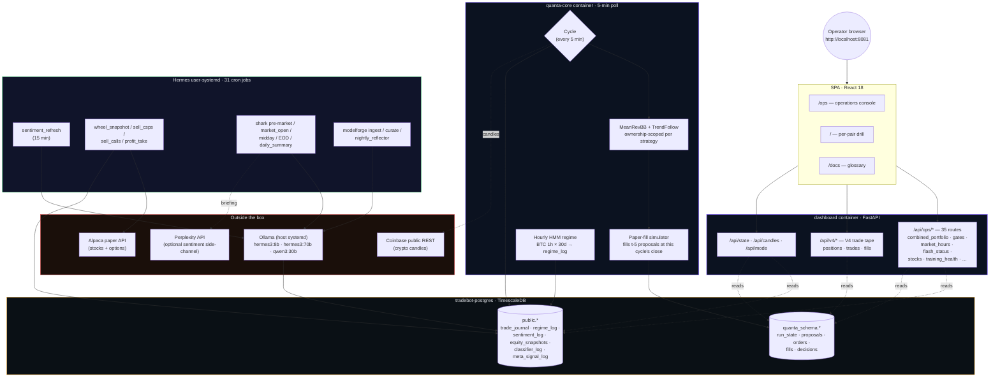
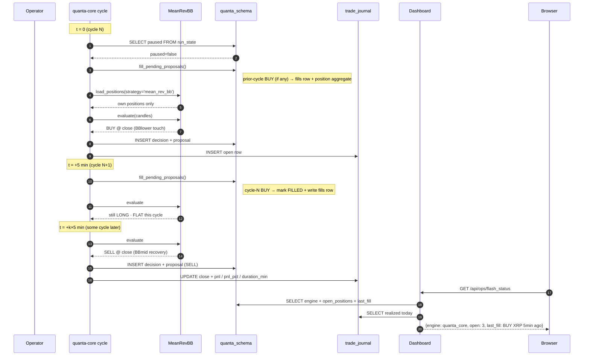
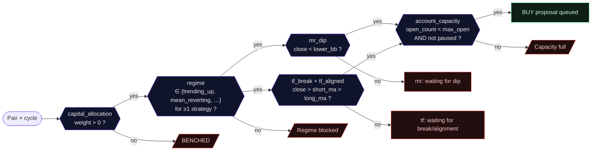
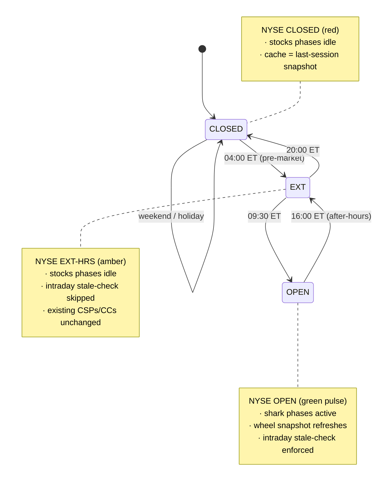
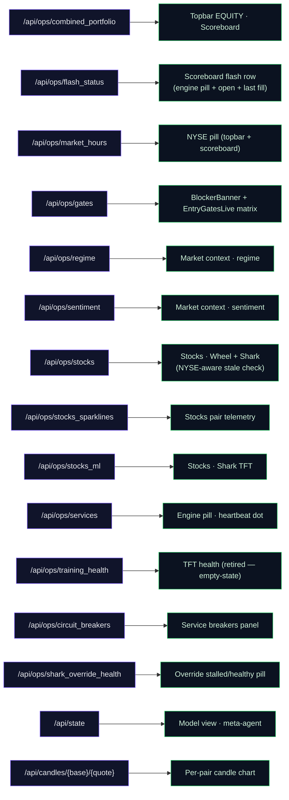

<!-- Licensed under the MIT License — see LICENSE at repo root.
     Copyright (c) 2026 Sai Jayanth. -->

<div align="center">

# Quanta — Self-Improving Local Trading Agent

**Fully-local, multi-engine paper-trading stack on a single NVIDIA DGX Spark.
V4 `quanta_core` runs the crypto engine, the Wheel runner trades cash-secured
puts on Alpaca paper, and a hermes-3 multi-agent debate layer scores sentiment.
Zero paid LLM APIs in the hot path.**

[](#whats-running-today)
[](#architecture)
[](LICENSE)
[](pyproject.toml)
[](docker-compose.yml)
[-76b900)](#hardware--cost)
[](#operating-principles)

</div>

---

## What this is

Quanta is a multi-engine, paper-trading platform that runs end-to-end on one
DGX Spark. It places paper orders against Coinbase (crypto) and Alpaca
(US-equities options), scores sentiment via Hermes 3 on local Ollama, and
surfaces every signal, gate, position, and trade on a single FastAPI ops
console.

The stack went through a major architectural cutover on **2026-05-13**:
the legacy `freqtrade` container was retired and replaced by `quanta_core`
(V4) — a from-scratch async Python engine with explicit ledger writes,
ownership-aware strategies, and a paper-fill simulator. Phases 4–7
(2026-05-13 → 2026-05-14) deleted the freqtrade folder, repointed paths,
removed dashboard imports of `freqaimodels`, and swapped the dashboard's
crypto entry-gate matrix from the V3 FreqAI columns (`model_freshness`,
`tft_confidence`, …) to the V4 strategy gates (`mr_dip`, `tf_break`,
`tf_aligned`, …) that MeanRevBB + TrendFollow actually evaluate.

This README reflects the **post-cutover, post-cleanup** architecture as of
**2026-05-14**. For the pre-cutover freqtrade-era version, check
`git tag pre-spa-cutover` or `docs/V4_SHADOW_MODE_DESIGN.md`.

---

## What's running today

| Component        | Container         | Role                                                                  |
|------------------|-------------------|-----------------------------------------------------------------------|
| `quanta-core`    | Docker            | V4 paper-trading engine for 12 crypto pairs (MeanRevBB + TrendFollow) |
| `dashboard`      | Docker            | FastAPI ops console + SPA; `/api/ops/*` + `/api/v4/*` surfaces        |
| `tradebot-postgres` | Docker         | TimescaleDB — V4 ledger, regime_log, sentiment_log, trade_journal     |
| Wheel runner     | Hermes cron       | Cash-secured-put cycle on Alpaca paper; fires every Friday morning    |
| Shark            | Hermes cron       | Pre-market / open / midday / EOD stock-analysis phases (LLM-driven)   |
| hermes-gateway   | systemd-user      | 31-job cron scheduler; sentiment, regime, KB updates, snapshots       |
| Ollama (host)    | systemd           | hermes3:8b (fast) + hermes3:70b (deep) + qwen3:30b (reflector)        |
| `model-forge`    | Docker × 4        | LoRA training pipeline + per-role champion adapter registry           |

```
                                ┌────────────────────────────────────────────┐
                                │  Operator console — http://localhost:8081  │
                                │  ╴ Ops console (V4-aware)                  │
                                │  ╴ Pair dashboard (per-symbol drill)       │
                                │  ╴ Docs / glossary                          │
                                └─────────────────────┬──────────────────────┘
                                                      │
                                       /api/ops/*     │     /api/v4/*
                                                      ▼
              ┌───────────────────────────────────────────────────────────────────┐
              │                          dashboard (FastAPI)                       │
              │                                                                    │
              │  • /api/ops/regime          ◄── regime_log (V4 cron writes hourly) │
              │  • /api/ops/sentiment       ◄── sentiment_log (15-min cron)        │
              │  • /api/ops/live_trades     ◄── V4 fills + wheel positions.json    │
              │  • /api/ops/gates           ◄── V4 strategy entry conditions       │
              │  • /api/ops/combined_portfolio ◄── unified_risk (V4-aware)         │
              │  • /api/ops/pause + /resume    ◄── quanta_schema.run_state writes  │
              │  • /api/ops/flash_status    ◄── engine + opens + realised P&L      │
              │  • /api/v4/positions        ◄── quanta_schema.fills aggregate      │
              │  • /api/v4/trades           ◄── recent fills (V4 trade tape)       │
              └─────────────────────┬─────────────────────────┬───────────────────┘
                                    │                          │
        ┌───────────────────────────┘                          └────────────────────────┐
        ▼                                                                                 ▼
┌──────────────────────────────────────┐                          ┌──────────────────────────────────────┐
│  quanta-core (V4 paper engine)        │                          │   Hermes cron services                │
│  scripts/run_v4_shadow.py             │                          │                                       │
│                                       │                          │  • regime_refresh (inside quanta-core)│
│  cycle (every 5 min):                 │                          │  • sentiment_refresh (15-min)         │
│   1. read run_state.paused — skip if  │                          │  • wheel_snapshot (1-min, NYSE hours) │
│      true (kill switch)               │                          │  • wheel_sell_csps / wheel_sell_calls │
│   2. hourly: HMM regime → regime_log  │                          │  • shark_pre_market / market_open /   │
│   3. fetch Coinbase 5m candles ×12    │                          │    midday / daily_summary             │
│   4. fill_pending_proposals (paper)   │                          │  • shark_briefing_alerts (regime)     │
│   5. run MeanRevBB + TrendFollow      │                          │  • nightly_reflector (qwen3:30b)      │
│      per pair (ownership-scoped)      │                          │  • modelforge_ingest / curate         │
│   6. write decisions/proposals/fills  │                          │  (29 enabled jobs total)              │
│   7. mirror fills → trade_journal     │                          │                                       │
└──────────────────────────────────────┘                          └──────────────────────────────────────┘
                    │                                                              │
                    └──────────────────┬───────────────────────────────────────────┘
                                       ▼
                         ┌────────────────────────────────┐
                         │  Postgres (tradebot-postgres)  │
                         │                                │
                         │   public.*                     │
                         │   ├ trade_journal (legacy +    │
                         │   │   V4 mirror)               │
                         │   ├ regime_log                 │
                         │   ├ sentiment_log              │
                         │   └ equity_snapshots           │
                         │                                │
                         │   quanta_schema.* (V4 ledger)  │
                         │   ├ run_state (kill switch)    │
                         │   ├ proposals                  │
                         │   ├ orders                     │
                         │   ├ fills                      │
                         │   ├ decisions                  │
                         │   └ quanta_schema_version      │
                         └────────────────────────────────┘
```

---

## System architecture (Mermaid)

A higher-fidelity view of the same diagram above — every box is a real
process, every arrow is a real read/write path:



## Architecture

### Crypto engine (V4 quanta_core)

The runtime is `scripts/run_v4_shadow.py` — a single-file polling runner
that exercises the V4 strategy ABC against live Coinbase data:

1. **Cycle cadence**: 5 minutes (configurable via `SHADOW_CYCLE_SEC`).
2. **Data feed**: Coinbase Exchange public REST (`/products/<id>/candles`),
   no auth required. WebSocket adapter exists at
   `src/quanta_core/exchanges/coinbase.py:CoinbaseExchange` but is not
   wired into the simple runner (deferred to V4.1).
3. **Strategies** (in `src/quanta_core/strategy/`):
   - `MeanRevBB` — Bollinger-band mean-reversion. Enters LONG when
     `close < lower_bb` in `{trending_up, mean_reverting}` regimes.
     Exits at `close > middle_bb`.
   - `TrendFollow` — 8/21 SMA trend follower. Enters LONG only on
     `trending_up` with `close > short_ma > long_ma`. Exits on
     `close < short_ma` or regime degrade.
4. **Ownership rule**: each strategy sees only the positions IT opened
   (via `fetch_positions(conn, strategy=…)`). Prevents the
   open-by-A-then-closed-by-B stomping pattern.
5. **Paper-fill simulator**: proposals are committed to
   `quanta_schema.proposals` immediately; the next cycle marks them
   FILLED at that cycle's close price and writes a row to
   `quanta_schema.fills`. No real Coinbase order placement (paper-only).
6. **Regime engine**: hourly inside the runner —
   `compute_and_write_regime()` pulls 30 days of BTC 1h candles, computes
   `[log_return, realized_vol_30d, volume_ratio, rsi_14]`, scores against
   a 4-state Gaussian HMM (model file
   `user_data/data/regime_hmm.json`), and writes a `regime_log` row.

### Stocks engine (Wheel)

Independent of V4. Runs as a series of Hermes cron jobs on the host:

- `wheel_snapshot` — minute-by-minute Alpaca account snapshot during
  NYSE hours; writes `stocks/wheel/state/account_snapshot.json`.
- `wheel_sell_csps` — Friday morning; sells cash-secured puts at delta
  ~0.35 on a watchlist (SOFI/NVDA/COIN/PLTR/MSTR/MARA + extras).
  Polls Alpaca for fill confirmation before committing to
  `positions.json` (a 2026-05-13 fix — see CHANGELOG).
- `wheel_profit_take` / `wheel_sell_calls` — takes profit when an open
  put hits 50% gain; rolls assigned stock into covered calls.

### Sentiment + Multi-source aggregator

`user_data/modules/sentiment_engine.py` runs every 15 minutes via Hermes
cron (`scripts/sentiment_refresh.py`). Six sources poll in parallel,
two Hermes-3 models score the merged headline list, trust-the-majority
emits a directional signal:

```
   Perplexity ─┐
   Reddit ─────┤
   RSS ────────┤   →   dedup   →   hermes3:8b  (fast scanner) ─┐
   Fear&Greed ─┤                   hermes3:70b (deep thinker) ─┴→  trust-majority
   CoinGecko ──┤                                                    │
   HackerNews ─┤                                                    ▼
   StockTwits ─┘                                            sentiment_log row
```

### Shark (stocks LLM analysts)

`stocks/shark/` — pre-market screening, debate orchestrator, trade
reviewer. Runs on local Ollama (hermes3:8b for fast roles, hermes3:70b
or qwen3:30b for deep). Surfaces decisions in
`stocks/memory/DAILY-HANDOFF.md` and `stocks/wheel/state/*`. Trades
flow through the Wheel runner when Shark approves.

### Dashboard

FastAPI app at `user_data/dashboard/`. Single-page React app over two
templates: `ops_spa.html` (operations console) and `dashboard_spa.html`
(per-pair drill-down). Reads exclusively from Postgres + on-disk state
files — no direct Coinbase or Alpaca calls in the hot path. Engine-aware
via `LIVE_ENGINE_MODE` env (live/shadow → V4; unset → legacy
freqtrade probe path retained for rollback).

---

## Operating principles

1. **Paper first.** Every component runs in paper mode by default. No
   real-money path is wired today; the V4 paper-fill simulator stands
   in for real exchange order placement until shadow-mode parity vs
   freqtrade is proven (see `docs/V4_SHADOW_MODE_DESIGN.md`).
2. **Additive cutover.** When V4 replaced freqtrade, the freqtrade image
   was retained, the legacy `/api/ops/*` endpoints kept working via
   V4-aware fallbacks, and rollback remained possible in ≤ 30 s.
3. **Operator-controlled kill switch.** `quanta_schema.run_state` is the
   single source of truth for paused/active. `/api/ops/pause` and
   `/api/ops/resume` UPSERT this row; the runner reads it at the top
   of every cycle. Paper-mode bypasses the legacy drawdown gate on
   resume (the freqtrade-era 30-day DD metric was contaminated by
   pre-cutover state).
4. **Strategy ownership.** Strategies never see each other's positions.
   Eliminates the structural stomping bug where one strategy entered
   and a sibling exited within 5 minutes.
5. **Zero paid APIs in hot path.** Perplexity is the only optional
   outbound LLM (sentiment side-channel only). Ollama serves every
   other LLM call locally.
6. **Commit, never auto-push.** `git push` is operator-gated for every
   push. The runner doesn't `git push`. Cron jobs that write to git-
   tracked files (kb-update, override_verify, etc.) commit but don't
   push.

---

## Trading flow (V4 crypto, paper mode)

```
   t = 0           t = 5 min                         t = 10 min                     ─►
   ─────────       ──────────                        ───────────
   regime check    cycle fires:                      cycle fires:
   (hourly cron)   ├ read run_state (paused?)        ├ read run_state
                   ├ fill_pending_proposals          ├ fill_pending_proposals
                   │   ╴ any t-5 proposal → mark      │   ╴ t-0 BUY fills @ this cycle's close
                   │     FILLED + write fills row    ├ load positions per strategy (ownership-scoped)
                   ├ load positions per strategy     ├ run MeanRevBB + TrendFollow per pair
                   ├ run MeanRevBB + TrendFollow     │   ╴ MeanRevBB on a BTC dip → emit BUY
                   ├ write decision rows             │   ╴ TrendFollow only sees its own positions
                   │   (FLAT or BUY/SELL)            ├ write proposal + decision rows
                   ├ if BUY/SELL: write proposal     ├ if BUY: mirror to trade_journal (open row)
                   └ mirror fills → trade_journal    └ exit
                       (SELL → close + pnl calc)
```

A trade's lifecycle: `BUY` proposed → next cycle paper-filled → position
counted in `quanta_schema` aggregate → strategy sees it next cycle and
may emit `SELL` exit → SELL proposed → next cycle paper-filled →
trade_journal row closed with `pnl`, `pnl_pct`, `duration_min`.

### Trade lifecycle — sequence view



### V4 entry-gate evaluation (per pair, every cycle)

The dashboard's `/api/ops/gates` endpoint exposes the same per-pair gate
matrix the strategies internally evaluate. Post-cutover the V3 FreqAI
gates were swapped for V4 strategy conditions:



Each gate row in the UI carries a concrete WHY string with prices:
`mr: close $79,732 ≥ lower_bb $79,383 · tf: short_ma $79,724 ≤ long_ma $79,881`.

### NYSE session state machine

Because stocks phases gate on regular-session hours but crypto runs 24/7,
the dashboard surfaces a venue-aware NYSE pill so the operator never
mistakes the 24/7 engine pill for "stocks are trading":



### Dashboard surfaces (route → consumer card)



---

## Bootstrapping

The full stack assumes a Linux host with Docker, Ollama, and ~32 GB free
RAM. Quick start (paper mode, single host):

```bash
# 1. Postgres + schema bootstrap (one-time)
docker compose up -d postgres
bash scripts/v4_db_bootstrap.sh

# 2. Ensure the HMM model is fitted (one-time + weekly cron)
test -f user_data/data/regime_hmm.json || \
  /home/saijayanthai/Documents/spark/envs/ml-env/bin/python3 \
    user_data/modules/regime_detector.py --fit

# 3. Pull Ollama models (one-time, large)
ollama pull hermes3:8b
ollama pull hermes3:70b
ollama pull qwen3:30b

# 4. Bring the stack up
docker compose up -d dashboard quanta-core

# 5. Verify
curl -s http://localhost:8081/api/mode | python3 -m json.tool
#   → {"engine":"quanta_core","mode":"paper","state":"running",...}
```

The dashboard is at `http://localhost:8081/ops`. The pair drill-down is
at `http://localhost:8081/`.

### Pause / Resume

```bash
HKEY=$(grep ^HERMES_MCP_KEY .env | cut -d= -f2)

# Pause V4 (existing positions stay open; new proposals are skipped)
curl -X POST http://localhost:8081/api/ops/pause \
  -H "Authorization: Bearer $HKEY" \
  -H "Content-Type: application/json" \
  -d '{"reason":"operator pause","set_by":"cli"}'

# Resume V4
curl -X POST http://localhost:8081/api/ops/resume \
  -H "Authorization: Bearer $HKEY" \
  -H "Content-Type: application/json" \
  -d '{"confirm":true,"reason":"back online"}'
```

### Rollback to freqtrade (≤ 30 s)

```bash
docker compose start freqtrade
sed -i 's/LIVE_ENGINE_MODE=live/LIVE_ENGINE_MODE=/' .env
docker compose up -d --no-deps quanta-core dashboard
```

---

## File layout

```
trading-bot/
├── src/quanta_core/                # V4 engine (additive code; not run by simple runner today)
│   ├── strategy/                   # Strategy ABC + MeanRevBB + TrendFollow
│   ├── execution/                  # Real-order placement (unused by paper runner)
│   ├── exchanges/                  # CoinbaseExchange + AlpacaExchange (REST + stub WS)
│   ├── ledger/                     # PostgresLedger + migrations 001/002/003
│   ├── agents/                     # DebateOrchestrator (unused by paper runner)
│   ├── live/                       # LiveEngine + dispatcher + reconciler (unused)
│   ├── risk/                       # RiskGovernor + MonteCarloEngine (unused)
│   └── observability/              # V4Buffer, parity_oracle, notifier
├── scripts/
│   ├── run_v4_shadow.py            # ← THE V4 PAPER RUNTIME (single-file)
│   ├── v4_db_bootstrap.sh          # creates quanta_schema, applies migrations
│   ├── v4_cutover.sh               # one-shot freqtrade→V4 cutover
│   ├── sentiment_refresh.py        # 15-min sentiment poll (Hermes cron entry)
│   └── nightly_reflector.py        # qwen3:30b post-mortem writer
├── user_data/
│   ├── dashboard/                  # FastAPI + React SPA (the ops console)
│   ├── modules/                    # Sentiment engine, news aggregator, unified_risk
│   ├── data/regime_hmm.json        # Fitted 4-state HMM model
│   └── universe.json               # Crypto pairs + stocks watchlist
├── stocks/
│   ├── wheel/                      # CSP / covered-call cycle (Alpaca paper)
│   ├── shark/                      # Pre-market / open / midday / EOD analysts
│   ├── kb/                         # Earnings + research cron output
│   └── memory/                     # DAILY-HANDOFF + decisions log
├── docs/
│   ├── V4_SHADOW_MODE_DESIGN.md    # The cutover blueprint
│   ├── POST-CUTOVER-AUDIT-2026-05-13.md  # Multi-agent audit + fix plan
│   ├── V4_CUTOVER_LOG.md           # Append-only cutover trail
│   ├── DEPLOY_LOG.md               # Image-rebuild log
│   └── superpowers/plans/          # Time-boxed execution plans
├── tests/                          # pytest suite: strategy/, observability/, integration/
├── Dockerfile.quanta_core          # The V4 runtime image
├── docker-compose.yml              # 4 services (postgres / dashboard / quanta-core / mf-*)
└── README.md                       # this file
```

---

## CHANGELOG

### 2026-05-14 — dashboard cleanup pass (post-cutover debt paydown)

Two commits (`a4941c9`, `b6c7756`) finished scrubbing the dashboard of
references to deleted freqtrade surfaces. After this pass, 20/21
`/api/ops/*` endpoints return `status=ok` (the 1 remaining `degraded`
is legitimate Shark "override stalled" signal — BEAR_VOLATILE regime
killing all candidates, not a bug).

| Area | Before | After |
|---|---|---|
| `/api/ops/training_health` | `status=down · "No module named 'freqaimodels'"` | `status=ok` with empty pairs |
| `/api/ops/gates` (crypto) | Returned V3 FreqAI gates (`model_freshness`, `tft_confidence`, `up_prob_threshold`, …) — all failing because `pair_dictionary.json` is gone | Returns V4 strategy gates (`mr_dip`, `tf_break`, `tf_aligned`, …) that MeanRevBB + TrendFollow actually evaluate; V3 set preserved under `v3_gates` for legacy callers |
| `/api/ops/stocks` after-hours | `degraded · "shark intraday stale: 17627s > 14400s"` whenever NYSE closed | NYSE-aware: stale check only enforced during regular session |
| Dashboard topbar (stocks venue) | Green "PAPER · DRY-RUN" pill always — operator misread as "stocks are trading" | Adds venue-aware **NYSE OPEN / EXT-HRS / CLOSED** pill |
| Ops scoreboard flash row | `QUANTA_CORE · LIVE` green-pulsing, no market context | Adds NYSE pill next to the engine pill |
| TFT model-health card empty-state copy | "bot is still in warm-up" | "FreqAI TFT retired post-cutover · quanta-core training-health producer not yet wired (Wave D)" |
| Blocker banner | `🚦 14/27 pairs blocked · 12/27 on model_freshness · …` (misleading) | `🚦 14/27 pairs blocked · 12/27 on mr_dip · 11/27 on tf_aligned · …` (truth) |
| Dead config keys | `freqaimodel` + `freqaimodel_path` in `config.json` + `config.backtest_blind.json` | Stripped |

Cache-bust bumped to `v4-cutover-019-cleanup`. Verified live via
Playwright (see commit messages for the verification commands).

### 2026-05-13 — V4 cutover

#### Major architectural changes

- **V4 cutover** — `freqtrade` retired (image retained for rollback);
  `quanta-core` container running `scripts/run_v4_shadow.py` is the
  active engine. Two strategies (MeanRevBB + TrendFollow) drive 12
  crypto pairs in paper mode. Migration `003_run_state.sql` adds the
  kill-switch singleton.
- **Sentiment re-home** — pre-cutover `sentiment_engine.py` ran inside
  freqtrade's strategy hook (thread, 15-min poll). Re-homed into a
  Hermes cron (`sentiment_refresh.sh`, 15-min cadence) so freqtrade's
  death doesn't silence the sentiment pipeline.
- **Regime cron in-process** — hourly HMM regime recompute now runs
  inside the V4 runner (was inside freqtrade pre-cutover).
- **Strategy ownership rule** — each V4 strategy sees only positions
  it opened. Eliminates the cross-strategy 5-min stomping bug.

### Dashboard

- Topbar engine pill: `QUANTA OK` (was hard-coded `FREQTRADE`).
- Entry Gates matrix: 6 V4-aware columns (cap / regime / mr·dip /
  tf·brk / tf·ma / open) replace 11 FreqAI / TFT-era columns. WHY
  string surfaces concrete prices: e.g. `mr: close $79,732 ≥ lower_bb
  $79,383 · tf: short_ma $79,724 ≤ long_ma $79,881`.
- Pair-telemetry sparklines: real 24h coverage (288 candles vs the
  pre-fix 60). `pct_24h` is now genuinely a 24-hour delta.
- Today's Scoreboard: V4 flash row inside the card —
  `●QUANTA_CORE · LIVE · open N · v4=X wheel=Y · v4 realized +$Z`.
- Pair telemetry chips: regime-only blocks no longer trigger
  strike-through styling; position-aware blockers
  (no_existing_csp / no_assignment) downgrade to "position open".
- Removed dead cards: Card 17 (FreqAI/TFT IDLE) and Card 00d
  (per-pair TFT model health) — both pure FreqAI-era surfaces.
- `unified_risk.py` `_crypto_realised_pnl` / `_crypto_unrealised_pnl` /
  `_crypto_open_count` now branch on `LIVE_ENGINE_MODE` and read from
  V4 sources (trade_journal + quanta_schema.fills + Coinbase ticker).
- `_ensure_jwt` short-circuits when V4 is active (was spamming
  ~190 freqtrade-login warnings per minute).
- Cache-buster bumped through `v4-cutover-001` → `v4-cutover-012`.

### Wheel

- `runner.sell_csps`: post-submit polls Alpaca for fill confirmation
  for up to 30 s before adding to `positions.json`. Pre-fix bug:
  limit orders that never reached price (PLTR @ $3.00, SOFI @ $0.35)
  were tracked as filled positions for hours, blocking re-attempts.
- `runner.sell_csps`: refreshes the account snapshot between
  iterations so `buying_power` stays current as fills drain it.
- `cli._wheel_exit_code`: distinguishes routine BP-rejects from
  fatal errors. Stops the every-Friday "wheel sell CSP exit code 1 +
  Alpaca 403" Slack alerts on partial-success runs.

### Hermes cron

- `nightly_reflector.sh` uses the `setsid + nohup + disown` detach
  pattern (qwen3:30b cold-load was tripping the 120 s SIGKILL).
- `stocks/shark/run.py:_pull_origin_main`: switched from
  `git pull --rebase` to `git fetch && git merge --ff-only` so cron-
  written files no longer trigger an abort on every shark phase.
- `yfinance` added to ml-env (reflector alpha-vs-benchmark math).
- `notifier.daily_summary`: shape-detection shim maps shark's
  `date / equity / day_pnl_dollars / weekly_trades` kwargs to
  SlackAlerter's `date_utc / starting_equity / …` signature.
- `resample_4h` job removed (freqtrade-dependent, dormant).
- New job `sentiment_refresh` (15-min cadence) — see above.

### Frontend bug fixes

- NVDA click on stocks pair telemetry no longer redirects to SPY.
  `useEffect` deps in `dashboard_spa.js` now include `stockSymbols`
  AND skip the venue-reset while the universe is in fallback.
- "Open positions" on Today's Scoreboard now aggregates V4 + wheel.

### Operator UX

- New `/api/ops/flash_status` endpoint — single-roundtrip "what is
  V4 doing right now?" payload (engine + open positions + closed-
  today P&L + regime + last fill).

---

## Tests

```bash
PYTHONPATH=. python3 -m pytest tests/ -q
```

Strategy ABC (sync, V4 design lock §5):
```bash
PYTHONPATH=. python3 -m pytest tests/strategy/ -v
```

Observability (V4 buffer + parity oracle):
```bash
PYTHONPATH=. python3 -m pytest tests/observability/ -v
```

---

## Hardware & cost

- Single NVIDIA DGX Spark (GB10, 128 GB unified memory).
- Ollama loaded with `hermes3:8b` (~5 GB), `hermes3:70b` (~40 GB), and
  `qwen3:30b` (~18 GB). All three coexist with `keep_alive=0s` on the
  deep models so VRAM frees between calls.
- Postgres + dashboard + V4 runner total ~600 MB RAM.
- **Paid LLM APIs in the hot path: $0/month.** Perplexity is the only
  optional outbound (sentiment side-channel; gracefully no-ops when
  unset).

---

## Honest open items

### Engine & strategy (substantive)
1. **No real Coinbase order placement.** Paper-fill simulator stays
   until the V4 ExecutionEngine + WebSocket streams land. See
   `docs/POST-CUTOVER-AUDIT-2026-05-13.md` Track D.
2. **No DebateOrchestrator** wired into BUY decisions. Built and
   tested at `src/quanta_core/agents/debate.py` but premature to
   enable until paper P&L baseline is established.
3. **No high-volatility regime strategy.** Both strategies refuse to
   enter in `high_volatility` (and `trending_down` for TrendFollow);
   universe goes to cash in those regimes by design until a directional
   strategy ports in.
4. **Wheel position reconciler.** Manual reconciliation was done
   2026-05-13. A periodic reconciler (`wheel_snapshot` cron syncing
   `positions.json` against `Alpaca.get_all_positions()`) is
   recommended next.
5. **No quanta-core training-health producer.** Wave D — a stocks-side
   `Stocks · Shark TFT` card exists and works; the crypto-side
   `/api/ops/training_health` endpoint returns empty pairs gracefully
   but won't show useful per-pair model freshness until quanta-core
   starts writing artifact-validity records to a successor of
   `pair_dictionary.json`.

### Dashboard cleanup debt (cosmetic, no runtime impact)
- `TrainingCardLive` + `TrainingHealthLive` React components still
  exist in `ops_spa.js` as dead code (~3 KB) — not mounted, but a
  future cleanup pass should delete them outright.
- `ops_routes.py:1698` still references `freqtrade.log` in the
  explainability endpoint; the file doesn't exist post-cutover and
  the read is guarded by `if log_path.exists()` so it's a silent
  no-op — but the comment block deserves a refresh.
- `frontend-v4/` SPA is untouched and additive (operator preference
  per `[[v4-is-additive]]`). When you revisit it, the legacy
  `/dashboard_spa` and `/ops` remain the active surfaces.

See `docs/POST-CUTOVER-AUDIT-2026-05-13.md` for the full ranked
backlog from the 4-agent post-cutover audit.

---

## License

MIT. See [LICENSE](LICENSE).

This is paper-trading software for educational and research purposes.
Trading involves risk of loss; nothing in this repository is investment
advice.
